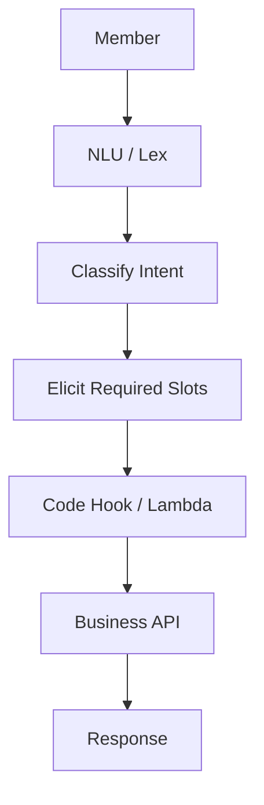
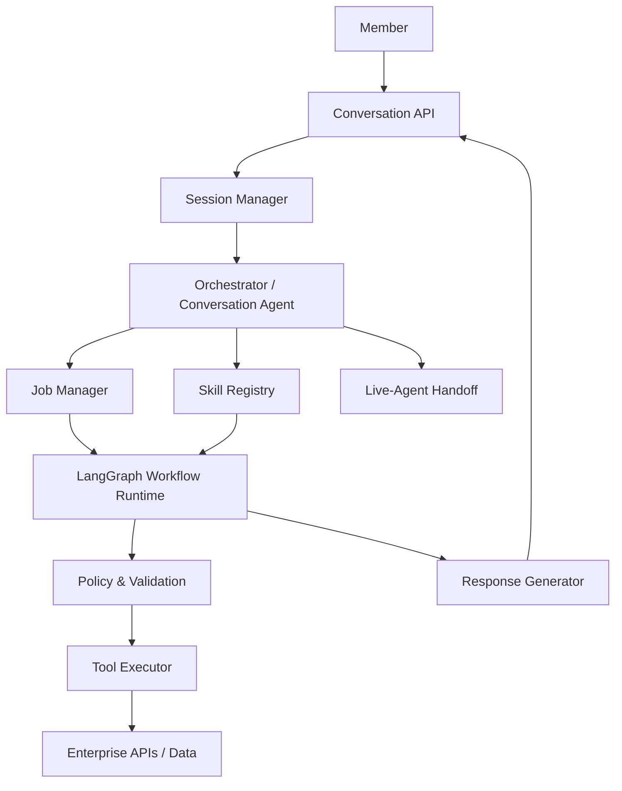
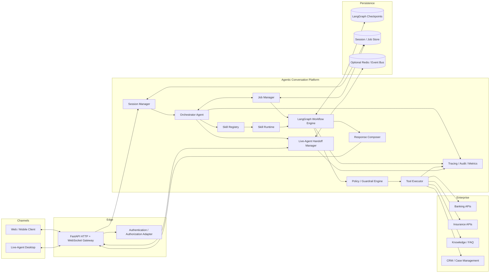
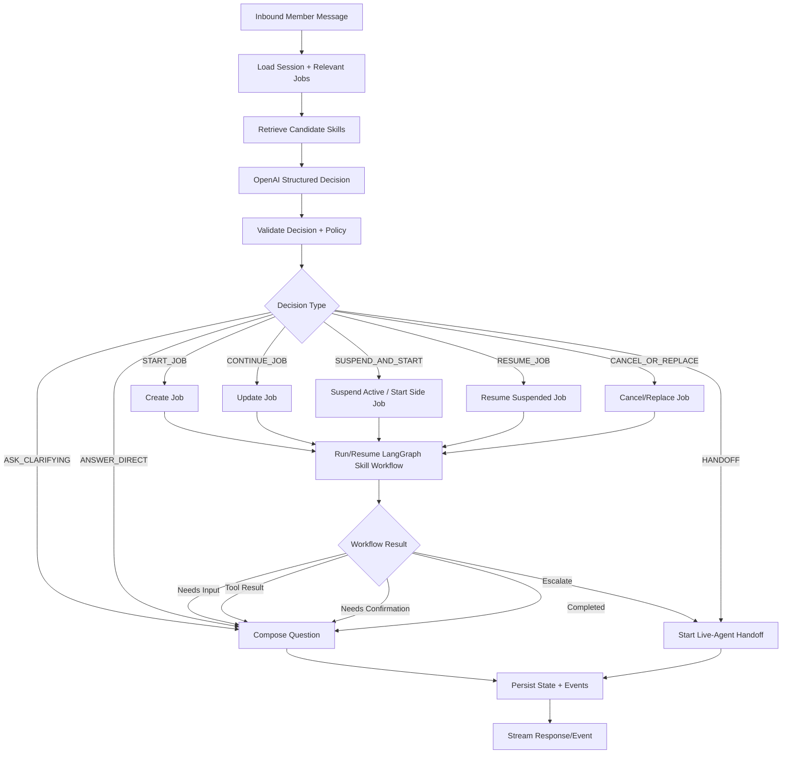
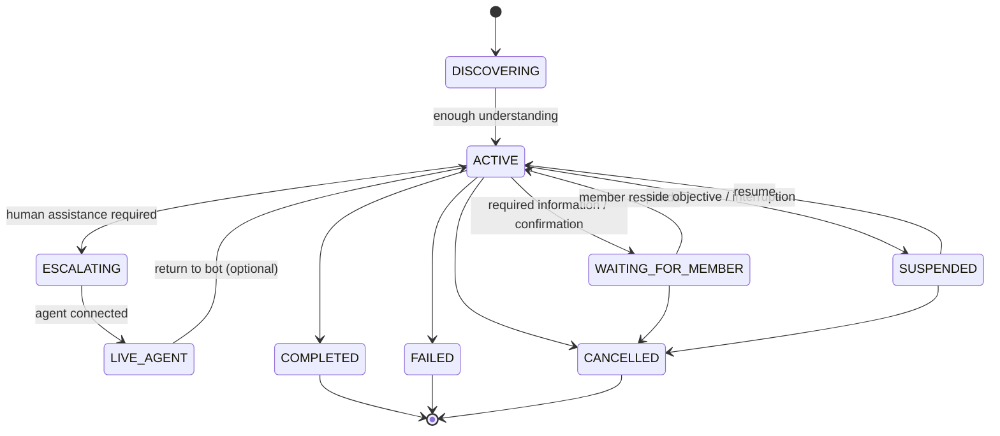
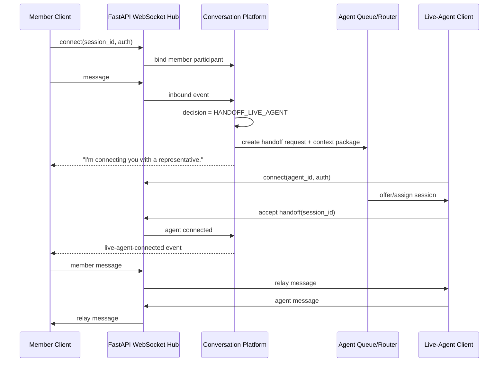

# Agentic Conversational Platform Architecture

**Status:** Draft for architecture review and implementation bootstrap  
**Audience:** Business stakeholders, enterprise architects, AI platform engineers, application engineers, security/risk, QA  
**Primary implementation:** Python, LangGraph, OpenAI GPT models, FastAPI/WebSockets  
**Architecture style:** LLM-first conversation orchestration + deterministic business execution + spec-driven skills

---

## 1. Purpose

This document is the source-of-truth architecture specification for a next-generation banking and insurance conversational platform.

The platform evolves the traditional **intent → slot elicitation → code hook → fulfillment** model into a **conversation-first, objective-driven agentic model**.

The LLM is responsible for understanding the member/client's evolving objective and deciding the next conversational action. The platform—not the model—owns session state, job lifecycle, policies, deterministic workflows, tool execution, audit records, and live-agent handoff.

The target experience is natural like a conversation with a knowledgeable representative, while execution remains governed, auditable, testable, and safe.

### 1.1 Guiding statement

> **Conversation is agentic. Execution is governed and deterministic.**

The model may reason about what should happen next. It must not bypass business rules, authorization, required confirmations, tool schemas, or policy gates.

---

## 2. Why this platform is different from a traditional Lex-style chatbot

### 2.1 Traditional model

A traditional Amazon Lex-style implementation commonly starts by enumerating intents. Each intent defines slots, prompts, code hooks, and a fulfillment path.



This model is strong when the conversation follows the path anticipated at design time. Its limitations become visible when:

- the initial objective is ambiguous or spans multiple business capabilities;
- the member answers indirectly rather than with the expected slot value;
- the member asks a side question in the middle of a workflow;
- the member changes or abandons the objective;
- several pieces of information arrive in one utterance;
- the member expects the assistant to remember and resume prior work;
- intent classification or slot extraction fails even though a human could easily understand the request.

### 2.2 Agentic model

The proposed platform does not require every user turn to resolve to one pre-authored intent. It continuously evaluates the conversation, updates structured state, and determines the next appropriate action.



The architecture retains deterministic execution where determinism matters, while using an LLM where natural-language understanding and contextual decision-making provide the largest benefit.

### 2.3 Mental-model mapping

| Traditional chatbot concept | Agentic platform concept | Explanation |
|---|---|---|
| Intent | Member objective + system job | The member expresses an objective. Once understood enough to act on, the system represents the work as a job. |
| Slots | Facts / parameters / constraints | Structured information needed by a skill. The user can provide it naturally, in any order, or several at once. |
| Dialog state | Session + job state | State is explicitly persisted and not reconstructed only from chat history. |
| Code hook | Tool / workflow action | Controlled application logic or API calls. |
| Fulfillment | Deterministic workflow completion | Consequential actions execute through governed workflows and tools. |
| Intent switch | Suspend / resume / replace job | Side questions and objective changes become first-class conversation behavior. |
| Bot fallback | Clarify / recover / hand off | The system can ask a targeted question, recover state, or involve a live agent. |

---

## 3. Terminology

Clear language is important. This architecture deliberately avoids saying that "the LLM has goals."

### Member Objective
What the member/client is trying to accomplish. It may initially be incomplete, ambiguous, or span multiple capabilities.

Examples:
- "How much money do I have in checking?"
- "Move $500 to savings."
- "I lost my debit card and I am traveling tomorrow."
- "I need help sorting out my finances after a life event."

### Job
A platform-owned unit of work created when the conversation has enough understanding to track meaningful progress toward an objective. Jobs can be active, waiting for information, suspended, completed, cancelled, failed, or escalated.

A job is **not an LLM goal**. It is a durable application record.

### Skill
A declarative business capability the platform can use to satisfy part or all of an objective.

Examples:
- Account Balance
- Money Transfer
- FAQ / Knowledge Answer
- Lock Card
- Replace Card
- Start Auto Quote
- Live-Agent Handoff

### Tool
A narrowly scoped executable operation exposed to a skill or workflow, usually backed by application code or an enterprise API.

Examples:
- `get_accounts`
- `get_account_balance`
- `validate_transfer`
- `create_transfer`
- `search_knowledge`
- `create_live_agent_case`

### Reasoning
For this platform, reasoning means **contextual decision-making about what should happen next**. It does not mean unrestricted autonomous execution.

Typical decisions include:
- ask a clarifying question;
- extract or update known facts;
- select a skill;
- continue an active job;
- temporarily suspend work for a side question;
- resume prior work;
- replace/cancel a prior job;
- invoke a read-only tool;
- request explicit confirmation;
- escalate to a live agent;
- complete the job.

### Plan
An evolving representation of the steps required to complete a job. A plan may be partial at first and refined as the conversation reveals more information. Deterministic skills may use a predefined workflow once enough facts are available.

---

## 4. Product goals

1. Provide natural, context-aware conversations without requiring exhaustive intent training.
2. Allow members to interrupt, ask side questions, change direction, and resume work naturally.
3. Preserve deterministic, policy-controlled execution for regulated or consequential actions.
4. Make business capabilities modular and reusable as declarative skills.
5. Allow new skills to be added without changes to the central orchestrator when the required tools and workflow primitives already exist.
6. Support low-code/no-code authoring for skills, prompts, required information, workflow steps, policies, and test cases.
7. Provide a first-class live-agent experience with full context transfer and real-time WebSocket communication.
8. Persist structured session/job state so conversations can survive process restarts and be audited.
9. Make every model decision, tool call, workflow transition, policy decision, and handoff observable.
10. Support banking and insurance capabilities on one common conversational runtime.

---

## 5. Non-goals

The initial platform will not:

- allow an LLM to directly perform money movement without deterministic validation and confirmation gates;
- rely on hidden model memory as the system of record;
- put all business logic in prompts;
- require one specialist agent per skill;
- assume every new external integration can be added with zero code;
- replace enterprise authorization, fraud, risk, compliance, or transaction systems;
- treat raw chat history as sufficient session state.

### 5.1 Important no-code boundary

A new skill can be added **without orchestrator code changes** when:

- its required tools already exist;
- its flow can be represented with supported workflow primitives;
- its policies can be expressed using existing validators/policy rules.

If the new skill requires a new downstream system or capability, a new tool adapter/integration is still required. The low-code promise is **configuration over central orchestration code**, not "no engineering ever."

---

## 6. Core architectural principles

### P1. LLM-first understanding, not NLU-first classification
The platform may infer business capability from natural language without requiring a traditional intent classifier as the first gate.

### P2. Structured decisions
The LLM must return a typed decision contract for orchestration. Free-form prose is not used as control flow.

### P3. Explicit state
Session, jobs, collected facts, workflow state, handoff state, and tool outcomes are stored explicitly.

### P4. Agentic conversation; deterministic side effects
The system can converse flexibly, but side-effecting actions follow fixed validation, authorization, confirmation, idempotency, and audit rules.

### P5. Skills are declarative modules
A skill describes what business capability it provides, when it applies, required facts, allowed tools, workflow, policies, response constraints, and tests.

### P6. Orchestrator is generic
The orchestrator must not contain `if skill == transfer_money` style business branching. New skills are discovered through the registry.

### P7. Tools are narrow and typed
Tools expose deterministic operations with JSON/Pydantic schemas, clear error contracts, authorization checks, timeouts, and observability.

### P8. Live-agent handoff is a platform capability
Any skill or policy may request human assistance without losing conversation or workflow context.

### P9. Policy wins over model preference
The model may recommend an action. The policy layer decides whether that action is allowed.

### P10. Every turn is recoverable
Persist enough state that a failed process can resume without losing job progress or replaying unsafe side effects.

---

## 7. High-level component architecture



---

## 8. Component responsibilities

### 8.1 API / WebSocket Gateway

Responsibilities:
- expose REST endpoints for health, session creation, history, metadata, and administration;
- expose WebSocket endpoints for member/client and live-agent channels;
- authenticate clients and bind transport connections to a session identity;
- stream incremental assistant events and workflow status;
- enforce payload size, rate, and protocol validation;
- never embed business routing logic.

Recommended initial technology: FastAPI with asynchronous WebSocket handlers.

### 8.2 Session Manager

The Session Manager owns the durable conversation envelope.

Responsibilities:
- create and retrieve sessions;
- associate authenticated member/client context;
- track participants and channel connection state;
- store conversation metadata and recent messages/events;
- maintain references to active/suspended jobs;
- maintain live-agent state;
- expose a minimal context object to the orchestrator;
- apply retention and privacy rules.

Session state is different from LangGraph state. Session state is the product-level record; LangGraph checkpoints are runtime execution state.

### 8.3 Orchestrator Agent

The Orchestrator Agent is the only general-purpose conversation decision maker.

Responsibilities on each member turn:
1. Load session and relevant job context.
2. Retrieve candidate skills from the Skill Registry.
3. Ask the OpenAI GPT model for a **structured ConversationDecision**.
4. Validate the decision against schema and policy.
5. Delegate execution to Job Manager / Skill Runtime / LangGraph.
6. Decide whether an immediate conversational response is required.
7. Persist the decision and resulting state transitions.

The orchestrator does **not** directly execute financial APIs.

### 8.4 Job Manager

The Job Manager tracks platform-owned work items that represent member objectives being fulfilled.

Responsibilities:
- create a job when an objective maps to actionable work;
- maintain the active job and suspended jobs;
- update facts/parameters as they are learned;
- enforce lifecycle transitions;
- associate a job with one or more skills/workflows;
- resume prior work after interruptions;
- cancel or replace work when the member changes direction;
- track completion, failure, escalation, and audit metadata.

A session may have multiple jobs, but the initial implementation should normally allow one foreground active job plus zero or more suspended jobs.

### 8.5 Skill Registry

Responsibilities:
- discover skill definitions at startup and optionally hot-reload in development;
- validate each skill against a schema;
- index skills by description, examples, domain, tags, eligibility, and tool dependencies;
- return a small candidate set to the orchestrator rather than injecting every skill into every prompt;
- version skill definitions;
- reject duplicate IDs or incompatible versions.

### 8.6 Skill Runtime

The Skill Runtime interprets declarative skill specifications.

Responsibilities:
- determine required facts that are missing;
- apply validation rules;
- start/continue a workflow;
- bind allowed tools to the workflow;
- request confirmation when specified;
- expose standardized completion/failure results;
- remain generic across banking and insurance.

### 8.7 LangGraph Workflow Engine

LangGraph is the durable orchestration runtime for multi-step work.

Use LangGraph for:
- stateful workflow execution;
- deterministic nodes and conditional routing;
- checkpointing;
- interruptions requiring member or live-agent input;
- resumable workflow execution;
- retries and recovery boundaries;
- subgraphs for reusable workflow primitives.

Do not use LangGraph nodes as a place to hide business-specific conversation text. Nodes should primarily update state, invoke policies/tools, or request structured input.

### 8.8 Policy / Guardrail Engine

The policy layer is authoritative.

It must support:
- input safety checks;
- PII/data handling rules;
- tool eligibility;
- authorization requirements;
- transaction limits;
- confirmation requirements;
- blocked actions;
- output policy and disclosure requirements;
- live-agent escalation rules;
- per-skill policy extensions.

For side-effecting tools, tool-specific checks run immediately before execution and may also validate the output.

### 8.9 Tool Executor

Responsibilities:
- invoke typed adapters to enterprise systems;
- enforce timeouts, retries, circuit breakers, and idempotency;
- attach correlation IDs;
- normalize tool errors;
- redact secrets from logs;
- record tool call metadata and outcomes;
- prevent the model from directly constructing arbitrary network requests.

### 8.10 Response Composer

Conversation control and language generation are separate concerns.

The Response Composer:
- receives a structured response intent, facts safe to reveal, and policy constraints;
- generates or templates the member-facing response;
- enforces length/format constraints programmatically where strictness matters;
- never invents tool outcomes;
- clearly indicates confirmation, error, escalation, or completion states.

This separation prevents a skill's workflow instructions from becoming an unreliable global style system.

### 8.11 Live-Agent Handoff Manager

Responsibilities:
- create an escalation request/case;
- build a structured handoff package;
- place the conversation in a waiting/connected state;
- connect member and live-agent WebSocket participants;
- route messages during human takeover;
- optionally keep the AI in "assist" mode for agent suggestions;
- support return from live agent to bot when allowed;
- persist full handoff timestamps and reason codes.

---

## 9. Per-turn orchestration lifecycle

Every inbound member message follows the same top-level lifecycle.



### 9.1 Important behavior

The LLM evaluates every conversational turn, but **deep planning is not required every turn**. A turn may simply update one fact and continue the current job.

---

## 10. Conversation Decision Contract

The OpenAI model must return a structured object. The exact schema may evolve, but the control surface should remain small and explicit.

```json
{
  "decision": "CONTINUE_JOB",
  "member_objective_summary": "Move money from checking to savings",
  "target_job_id": "job_123",
  "candidate_skill_id": "money_transfer",
  "fact_updates": {
    "amount": 500,
    "currency": "USD"
  },
  "missing_information": ["source_account", "destination_account"],
  "side_question": false,
  "requires_confirmation": false,
  "handoff_reason": null,
  "response_directive": "Ask for the source account",
  "confidence": 0.94
}
```

### 10.1 Allowed decision types

Initial enum:

- `ANSWER_DIRECT`
- `ASK_CLARIFYING`
- `START_JOB`
- `CONTINUE_JOB`
- `SUSPEND_AND_START`
- `RESUME_JOB`
- `CANCEL_JOB`
- `REPLACE_JOB`
- `REQUEST_CONFIRMATION`
- `HANDOFF_LIVE_AGENT`
- `COMPLETE_JOB`
- `DECLINE_OR_BLOCK`

The model is not allowed to invent new decision types.

---

## 11. Job lifecycle



### 11.1 Job record

Minimum fields:

```yaml
job_id: string
session_id: string
objective_summary: string
status: DISCOVERING | ACTIVE | WAITING_FOR_MEMBER | SUSPENDED | ESCALATING | LIVE_AGENT | COMPLETED | FAILED | CANCELLED
skill_id: string | null
skill_version: string | null
facts: object
missing_information: [string]
workflow_thread_id: string | null
parent_job_id: string | null
suspension_reason: string | null
created_at: timestamp
updated_at: timestamp
completed_at: timestamp | null
result_summary: string | null
```

---

## 12. Skill architecture

### 12.1 Skill definition

A skill is a versioned declarative module. Suggested layout:

```text
skills/
  money_transfer/
    skill.yaml
    prompts.md              # optional skill-specific language guidance
    policies.yaml           # optional skill-specific policies
    tests.yaml              # conversational contract tests
```

The first implementation may keep workflow and policy sections inside `skill.yaml`; split them only when complexity justifies it.

### 12.2 Example skill specification

```yaml
id: money_transfer
version: 1.0.0
domain: banking
name: Transfer Money
description: Move funds between eligible member accounts.
examples:
  - "move 500 dollars from checking to savings"
  - "transfer some money into my savings"
  - "send 100 from account ending 1234 to my other account"

required_facts:
  - name: source_account
    type: account_reference
    required: true
  - name: destination_account
    type: account_reference
    required: true
  - name: amount
    type: money
    required: true

allowed_tools:
  - list_eligible_accounts
  - get_account_balance
  - validate_transfer
  - execute_transfer

workflow:
  type: deterministic
  steps:
    - ensure_facts: [source_account, destination_account, amount]
    - call: validate_transfer
    - require_confirmation:
        summary_template: "Transfer {amount} from {source_account} to {destination_account}?"
    - call: execute_transfer
    - complete: true

policies:
  side_effecting: true
  explicit_confirmation: required
  authentication: required
  idempotency: required

responses:
  max_sentences: 5
  confirmation_style: concise
```

### 12.3 Dynamic loading

The orchestrator must not require code changes to recognize a newly added valid skill. The registry loads the spec, validates it, indexes it, and makes it available to skill selection.

However, `allowed_tools` must resolve to registered tools. Unknown tools cause the skill to fail startup validation.

---

## 13. Workflow model

Skills may use one of three execution modes.

### 13.1 Direct answer
Use for FAQ/knowledge questions where no job or transaction workflow is necessary.

### 13.2 Deterministic workflow
Use for transactions and well-defined operational processes.

Example:

```text
collect/resolve facts
        ↓
validate eligibility
        ↓
fetch authoritative data
        ↓
show summary
        ↓
explicit confirmation
        ↓
execute
        ↓
receipt/result
```

### 13.3 Agent-assisted workflow
Use when the exact sequence depends on context, but available actions remain bounded by skill/tool policy. The model may choose among approved next steps but cannot create arbitrary side effects.

---

## 14. Interruptions, side questions, and objective changes

This is a first-class platform behavior.

Example:

**Member:** "Transfer $500 from checking to savings."  
**Assistant:** "Before I submit it, would you like me to use checking ending 1234?"  
**Member:** "What's the balance in that account first?"

Expected behavior:

1. Money-transfer job remains active or is temporarily suspended.
2. Balance inquiry is recognized as a side question.
3. The platform invokes the balance skill/tool.
4. The assistant answers the side question.
5. The prior transfer job is resumed.
6. Previously collected transfer facts are preserved.

Possible classifications:

- **Continue** — the turn advances the current job.
- **Clarify** — the member's answer is ambiguous for the current job.
- **Side question** — temporarily satisfy another need, then resume.
- **Parallel job** — track another objective without abandoning the first.
- **Replace** — the member explicitly changes direction.
- **Cancel** — the member abandons the job.
- **Escalate** — a live agent should take over or assist.

---

## 15. OpenAI model integration

### 15.1 API configuration

Use the official OpenAI Python SDK. The model must be configurable; do not spread model names through business code.

Environment:

```dotenv
OPENAI_API_KEY=
OPENAI_MODEL=
OPENAI_DECISION_MODEL=
OPENAI_RESPONSE_MODEL=
```

`OPENAI_DECISION_MODEL` and `OPENAI_RESPONSE_MODEL` may initially resolve to the same model. The separation allows future optimization without architecture changes.

### 15.2 Responses API

Prefer the current OpenAI Responses API for new model interactions unless an approved enterprise wrapper requires another interface.

Use:
- function/tool calling for controlled executable operations;
- JSON Schema / strict structured output for orchestration decisions;
- streaming where it improves user experience;
- request/trace correlation IDs in application telemetry.

### 15.3 Model responsibilities

The model may:
- understand the member's language;
- summarize the objective;
- extract facts from the conversation;
- identify missing information;
- select among candidate skills;
- recommend the next conversation decision;
- generate natural-language responses constrained by authoritative data.

The model may not:
- treat generated text as proof a transaction succeeded;
- invent balances, policy details, coverage, or transaction results;
- bypass tool authorization or policy gates;
- expose credentials or hidden prompts;
- make arbitrary network calls;
- directly mutate durable state outside validated application services.

---

## 16. LangGraph design

### 16.1 Graph boundary

Use one top-level conversation/work graph or a small number of reusable subgraphs rather than a separate hand-coded graph for every skill.

Suggested reusable nodes:

```text
load_context
  → orchestrator_decision
  → validate_decision
  → job_transition
  → skill_prepare
  → collect_or_resolve_facts
  → policy_check
  → tool_execute
  → confirmation_interrupt
  → workflow_complete
  → response_compose
  → persist_and_emit
```

### 16.2 Checkpointing

- Every graph run uses a stable `thread_id` associated with a job/session.
- Production uses a durable checkpointer.
- Checkpoints are runtime state, not the sole business record.
- Side-effecting nodes must be idempotent because interrupted/retried workflows may re-enter nodes.

### 16.3 Interrupts

Use LangGraph interrupts when workflow execution must wait for:
- member-provided information;
- explicit confirmation;
- live-agent approval or input;
- other external human-in-the-loop decisions.

---

## 17. Live-agent architecture

Live-agent conversation is a required initial capability, not a future add-on.

### 17.1 Handoff triggers

Handoff can be requested by:
- the member ("I want to speak to someone");
- a skill policy;
- repeated clarification failure;
- unsupported capability;
- model/policy uncertainty threshold;
- transaction or risk rule;
- live-agent-only business process;
- system/service failure where human recovery is preferred.

### 17.2 Handoff package

Before handoff, create a structured package containing only authorized information:

```yaml
session_id: string
member_context_summary: string
conversation_summary: string
handoff_reason: string
active_job:
  job_id: string
  objective_summary: string
  status: string
  skill_id: string
  known_facts: object
  missing_information: [string]
completed_jobs: []
recent_tool_results: []
policy_flags: []
```

The live agent should not need to reread the entire transcript to understand why the member is there.

### 17.3 WebSocket topology



### 17.4 Human takeover modes

Support at least:

1. **BOT_ACTIVE** — bot owns the member conversation.
2. **WAITING_FOR_AGENT** — bot may provide limited status updates but must not continue a risky transaction unless policy allows.
3. **AGENT_ACTIVE** — live agent owns customer-facing responses.
4. **AGENT_ASSISTED** — optional mode where AI privately suggests information/replies to the agent.
5. **BOT_RESUMED** — conversation is returned to the bot with explicit state transition.

### 17.5 WebSocket endpoints

Initial proposal:

```text
/ws/member/{session_id}
/ws/agent/{session_id}
```

Production identity should come from authenticated claims, not only path parameters.

### 17.6 WebSocket event envelope

```json
{
  "event_id": "evt_123",
  "session_id": "session_123",
  "type": "message.created",
  "actor": "member",
  "timestamp": "2026-08-06T12:00:00Z",
  "payload": {
    "text": "I want to speak to someone"
  }
}
```

Initial event types:

- `session.connected`
- `message.created`
- `assistant.delta`
- `assistant.completed`
- `job.updated`
- `confirmation.requested`
- `handoff.requested`
- `handoff.queued`
- `handoff.agent_connected`
- `handoff.agent_disconnected`
- `handoff.completed`
- `error`

---

## 18. Initial reference use cases

### UC1. Account Balance

Member:
> "What's in my checking account?"

Expected flow:
1. Orchestrator identifies balance inquiry.
2. If the account is unambiguous, invoke `get_account_balance`.
3. If multiple accounts match, ask a natural clarification.
4. Return only authoritative tool data.
5. Complete the job or answer directly depending on implementation policy.

### UC2. Money Transfer

Member:
> "Move $500 from checking to savings."

Expected flow:
1. Extract amount/source/destination if present.
2. Resolve account references using authorized member account data.
3. Validate transfer.
4. Require explicit confirmation.
5. Execute with idempotency key.
6. Return authoritative result/receipt.

### UC3. FAQ / Knowledge

Member:
> "How long does a mobile deposit usually take?"

Expected flow:
1. Route to knowledge skill.
2. Retrieve approved content.
3. Generate a concise answer grounded in retrieved content.
4. Apply response policy.
5. No transaction job is required unless the conversation becomes actionable.

### UC4. Interruption and Resume

Member:
> "Transfer $500 from checking to savings."

During confirmation:
> "What's my checking balance first?"

Expected flow:
- preserve transfer job;
- satisfy balance inquiry;
- ask whether to continue/resume the pending transfer when appropriate.

### UC5. Live-Agent Handoff

Member:
> "I don't want to do this with the bot. Get me a person."

Expected flow:
1. Honor handoff intent without forcing extra bot troubleshooting.
2. Persist current job state.
3. Create concise handoff package.
4. Queue/assign a live agent.
5. Keep member informed of connection state.
6. On agent acceptance, switch to `AGENT_ACTIVE`.

---

## 19. Initial project structure

```text
agentic-chat-platform/
├── Architecture.md
├── prompts.md
├── README.md
├── .env.example
├── pyproject.toml
├── app/
│   ├── main.py
│   ├── api/
│   │   ├── http.py
│   │   └── websocket.py
│   ├── core/
│   │   ├── config.py
│   │   ├── models.py
│   │   └── errors.py
│   ├── conversation/
│   │   ├── orchestrator.py
│   │   ├── decisions.py
│   │   ├── response_composer.py
│   │   └── graph.py
│   ├── sessions/
│   │   ├── manager.py
│   │   ├── models.py
│   │   └── repository.py
│   ├── jobs/
│   │   ├── manager.py
│   │   ├── models.py
│   │   └── repository.py
│   ├── skills/
│   │   ├── registry.py
│   │   ├── runtime.py
│   │   ├── schema.py
│   │   └── loader.py
│   ├── workflows/
│   │   ├── nodes.py
│   │   ├── primitives.py
│   │   └── checkpointer.py
│   ├── tools/
│   │   ├── registry.py
│   │   ├── executor.py
│   │   └── adapters/
│   ├── policies/
│   │   ├── engine.py
│   │   └── rules.py
│   ├── handoff/
│   │   ├── manager.py
│   │   ├── websocket_hub.py
│   │   ├── models.py
│   │   └── repository.py
│   └── observability/
│       ├── tracing.py
│       ├── audit.py
│       └── metrics.py
├── skills/
│   ├── account_balance/
│   ├── money_transfer/
│   ├── faq/
│   └── live_agent_handoff/
├── schemas/
├── tests/
│   ├── unit/
│   ├── contract/
│   ├── conversation/
│   ├── integration/
│   └── e2e/
└── docs/
    └── adr/
```

---

## 20. Persistence strategy

Recommended logical stores:

### Session / Job Store
Durable application database (e.g. PostgreSQL) for:
- session metadata;
- job lifecycle;
- skill/version references;
- handoff state;
- audit-friendly business state.

### LangGraph Checkpointer
Durable checkpointer for graph execution state. PostgreSQL is a natural production candidate.

### Event / Presence Store
Optional Redis for:
- WebSocket presence;
- live-agent queue notifications;
- distributed pub/sub when multiple application instances are running;
- short-lived delivery state.

Do not make Redis the only durable system of record for member/job state.

---

## 21. Security, privacy, and financial-control requirements

The implementation must be designed so these controls can be integrated from the beginning:

- strong authentication and authorization;
- server-side member identity derived from trusted claims;
- least-privilege tool access;
- secrets only from environment/secret manager, never prompts or source control;
- PII minimization in model context and logs;
- configurable retention/redaction;
- no account/transaction data fabricated by the model;
- explicit confirmation for configured consequential actions;
- idempotency for write operations;
- immutable/auditable action records where required;
- prompt-injection defenses around external/knowledge content;
- tool arguments validated independently of model output;
- rate limiting and abuse protections;
- live-agent authorization and session access controls;
- transcript and model telemetry controls appropriate to enterprise policy.

---

## 22. Observability

Each turn should be traceable through a correlation chain:

```text
session_id
  → message_id
  → orchestration_decision_id
  → job_id
  → workflow_run_id / LangGraph thread_id
  → tool_call_id
  → response_id
  → handoff_id (when applicable)
```

Capture:
- latency per stage;
- token/model usage;
- skill-selection confidence;
- clarification counts;
- tool success/failure;
- policy blocks;
- confirmation abandonment;
- handoff reason/time-to-agent;
- job completion rate;
- resume-after-interruption success;
- user correction rate;
- fallback/recovery rate.

Never log secrets or unrestricted sensitive payloads.

---

## 23. Testing strategy

### 23.1 Unit tests
- schema validation;
- job transitions;
- skill loading;
- workflow primitives;
- policy rules;
- tool adapters;
- WebSocket event routing.

### 23.2 Contract tests
Every skill must include tests asserting:
- examples map to the skill when appropriate;
- required facts are detected;
- invalid facts are rejected;
- only allowed tools are callable;
- confirmation rules are enforced;
- completion criteria are deterministic.

### 23.3 Conversation tests
Test multi-turn behaviors, not only one-turn classification:
- indirect answers;
- multiple facts in one turn;
- corrections;
- side questions;
- suspend/resume;
- replace/cancel;
- repeated clarification;
- handoff request at any point.

### 23.4 Model evaluation
Maintain an evaluation dataset for the structured ConversationDecision contract. Do not rely only on manual prompt testing.

### 23.5 Integration/E2E
Run with fake enterprise adapters first, then approved sandbox services.

---

## 24. Coding standards for the implementation agent

1. Python code must use type hints and Pydantic models for boundaries.
2. All network and model I/O should be async where practical.
3. Do not use dictionaries as long-lived domain models when a typed model is appropriate.
4. Do not place business-specific branching in the orchestrator.
5. Do not allow an LLM string to become executable control flow without schema validation.
6. Tools must be separately callable/testable without the LLM.
7. Side-effecting tools require idempotency and explicit error types.
8. Skill files must validate at startup.
9. Failed skill validation must fail fast with actionable diagnostics.
10. WebSocket protocol uses typed event envelopes.
11. Every module should have focused responsibilities and dependency injection boundaries.
12. Core domain modules should not depend directly on FastAPI request objects.
13. Do not hard-code model IDs; use configuration.
14. Never commit `.env` or API keys.
15. Write tests alongside every implementation increment.

---

## 25. Implementation phases

### Phase 1 — Platform skeleton
- FastAPI service
- configuration / `.env`
- OpenAI client abstraction
- typed session/job models
- in-memory repositories for local development
- Skill Registry + YAML validation
- ConversationDecision schema
- LangGraph skeleton
- WebSocket hub

### Phase 2 — Read-only reference skills
- Account Balance using fake/member account adapter
- FAQ/knowledge skill
- natural fact extraction
- direct answer + clarification patterns

### Phase 3 — Deterministic transaction skill
- Money Transfer
- eligibility validation
- explicit confirmation
- LangGraph interrupt/resume
- idempotent fake transaction executor

### Phase 4 — Interruption/job lifecycle
- suspend/resume
- side-question handling
- replace/cancel
- job history and session continuity

### Phase 5 — Live-agent handoff
- member and agent WebSocket clients
- handoff queue abstraction
- context package
- agent takeover/release
- optional agent-assist mode

### Phase 6 — Production hardening
- PostgreSQL repositories
- durable LangGraph checkpointer
- Redis pub/sub/presence if required
- observability/tracing
- security/policy integration
- load/failure testing
- eval pipeline

---

## 26. Definition of done for the first reference application

The reference implementation is complete when all of the following work end-to-end:

1. A member can open a WebSocket conversation.
2. The OpenAI model returns validated structured orchestration decisions.
3. The account-balance skill can be discovered from configuration and fulfilled through a tool.
4. The FAQ skill can answer from an approved mock knowledge source.
5. The money-transfer skill collects missing facts naturally, validates the transfer, requests explicit confirmation, and performs an idempotent mock execution.
6. A member can ask a balance side question during transfer and return to the transfer without losing collected facts.
7. A member can cancel or replace an active job.
8. A member can request a live agent at any point.
9. A live agent can connect over WebSocket, receive the handoff summary, and exchange messages with the member.
10. Session/job state survives service restart once durable repositories are enabled.
11. A new read-only skill using existing tools can be added through a valid skill spec without modifying orchestrator code.
12. Automated tests cover the core orchestration and conversation scenarios.

---

## 27. Architecture decisions to capture as ADRs

Create these as implementation progresses:

- **ADR-000:** Adopt spec-driven development for conversational skills
- **ADR-001:** Use a generic LLM orchestrator with structured decisions
- **ADR-002:** Use Job Manager for objective/work lifecycle
- **ADR-003:** Use LangGraph for durable workflow execution
- **ADR-004:** Separate product session state from graph checkpoint state
- **ADR-005:** Use declarative skill specifications and dynamic registry
- **ADR-006:** Deterministic execution and confirmation for side effects
- **ADR-007:** Separate response composition from workflow logic
- **ADR-008:** First-class live-agent handoff over WebSockets
- **ADR-009:** Tool registry and enterprise adapter boundary
- **ADR-010:** Observability/evaluation requirements for LLM decisions

---

## 28. Instructions to AI coding agents

Before writing code:

1. Read this entire file.
2. Read `prompts.md`.
3. Treat this document as architecture constraints, not suggestions.
4. If an implementation choice conflicts with this document, stop and document the conflict rather than silently changing the architecture.
5. Build vertical slices and keep the application runnable after each slice.
6. Start with fake adapters and deterministic fixtures; do not block the platform on real enterprise integrations.
7. Do not create a traditional intent classifier unless explicitly requested by a future ADR.
8. Prefer one generic orchestration loop plus declarative skills over duplicated per-skill agent code.
9. Keep agent reasoning bounded by candidate skills, typed decisions, policies, and tools.
10. Provide tests and update architecture/spec documentation with every meaningful capability.

---

## 29. References

Implementation should track current official documentation rather than copying stale API examples:

- OpenAI Developer Quickstart / Responses API: https://platform.openai.com/docs/
- OpenAI Agents SDK concepts (agents, tools, handoffs, guardrails): https://openai.github.io/openai-agents-python/
- LangGraph documentation (persistence, interrupts, graph APIs): https://docs.langchain.com/oss/python/langgraph/

These references inform implementation primitives; this architecture intentionally owns the higher-level product concepts of sessions, jobs, skills, governed workflows, and live-agent handoff.
