# Agentic Chat Architecture Deck

> **Presenter note:** Slides 1–15 describe the target architecture. Slides
> 16–18 distinguish the working POC from that target and provide the live demo
> story. Do not present future contact-center routing or dynamic planning as
> already implemented.

**Format:** Markdown slide deck with Mermaid diagrams and speaker notes.

Use with Marp, Reveal.js, GitHub Markdown, or copy diagrams into PowerPoint.

---

# Slide 1: Title

## From Intent-Based Chatbots to Objective-Driven Agentic Conversations

**Subtitle:** A high-level architecture vision for banking and insurance conversations

**Key message:** We are not replacing trusted enterprise execution. We are modernizing the conversation layer.

**Speaker notes:**
Open by positioning this as an evolution, not a rip-and-replace. The business should hear: better member experience, less brittleness, more reuse, and stronger governance. Architects should hear: state, policy, deterministic execution, and observability remain first-class.

---

# Slide 2: Why Evolve

## Intent-centric systems are predictable, but conversations are not

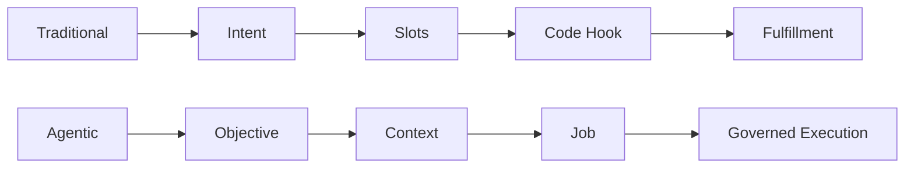

**Talk track:**
Traditional systems work well when the member follows the expected path. But real conversations include incomplete requests, side questions, corrections, and changes of direction. The new platform treats conversation as a first-class capability.

**Speaker notes:**
Do not criticize Lex. Acknowledge that it gave us structure and determinism. Then explain that the issue is the mental model: intent plus slots assumes the member behaves like the flow designer predicted.

---

# Slide 3: Executive Architecture

## One platform, many channels, many business capabilities

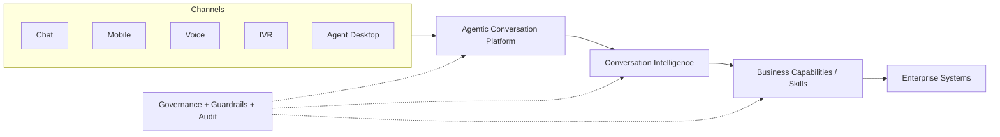

**Key message:**
A consistent member experience across chat, voice, IVR, and human-agent channels.

**Speaker notes:**
Keep this slide simple. This is the leadership view. Avoid LangGraph, job lifecycle, and model-specific details here. The point is: one adaptive conversation layer, many reusable business capabilities, trusted enterprise systems behind it.

---

# Slide 4: Core Principle

## Federated governance: capabilities declare the lane; the platform enforces it

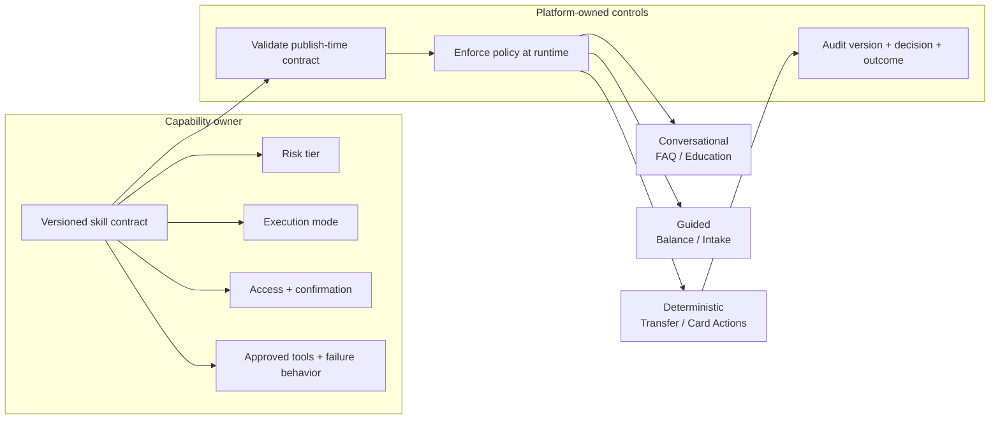

**Key message:**
Business teams can publish capabilities with their own declared governance. The platform prevents those controls from being bypassed by a prompt, channel, or model decision.

**Risk-tier examples:** Informational — FAQ · Navigation — recovery journey · Read-only — balance · Consequential — transfer · Handoff — live support

**Speaker notes:**
This is the selling point: governance is federated, enforcement is centralized.
Capability owners declare the business contract: risk tier, execution mode,
approved tools, access requirements, confirmation, safe failure behavior, and
acceptance criteria. Platform owners define the allowed vocabulary and workflow
primitives, validate the artifact at publication, enforce policy at execution,
and retain evidence. A risk tier is not merely a label: it makes a transfer,
balance read, FAQ, navigation action, and handoff visibly different classes of
work. In the POC, risk tier drives multi-goal ordering and constrains valid
confirmation designs; companion governance fields declare the exact access and
tool controls. Do not claim every enterprise policy is implemented already.

---

# Slide 5: Platform Component View

## The platform owns state, jobs, policies, and execution

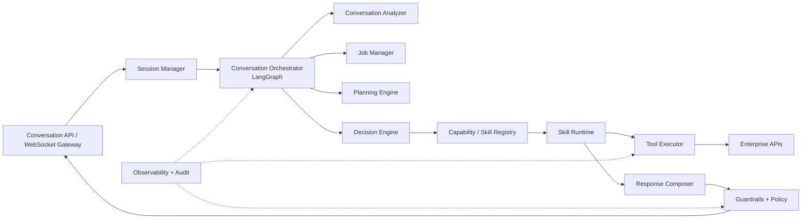

**Speaker notes:**
The model is not a monolith. We split responsibilities: analyze conversation, manage jobs, create/update plans, decide next action, execute skills, compose responses, and enforce guardrails. LangGraph coordinates the loop.

---

# Slide 6: Mental Model

## One objective creates one or more jobs when it has independent outcomes.

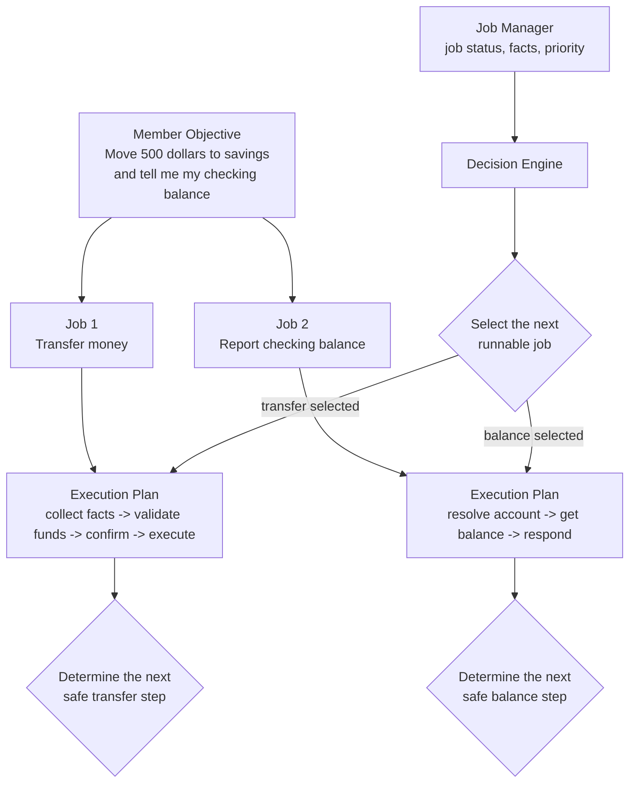

**Memorable line:**
Members own objectives. The platform owns jobs. Jobs own execution plans. Every turn advances the right job.

**Decomposition rule:**
Create a separate job only for an independently requested or independently resumable outcome. A balance lookup needed to validate a transfer remains a step in the transfer job's plan.

**Speaker notes:**
This slide prevents terminology confusion. Objective is human language. Job is platform state. Plan is how that job gets done. Here the member explicitly requested two outcomes, so the platform creates two jobs. The transfer plan may check available funds, but that is validation for the transfer, not a separate balance job. The Job Manager supplies each job's status, facts, and policy-derived priority. The Decision Engine selects one runnable job, then chooses the next safe step from that job's plan. Priority belongs to jobs, not plans.

---

# Slide 7: Conversation Processing Lifecycle

## Every turn follows the same governable loop

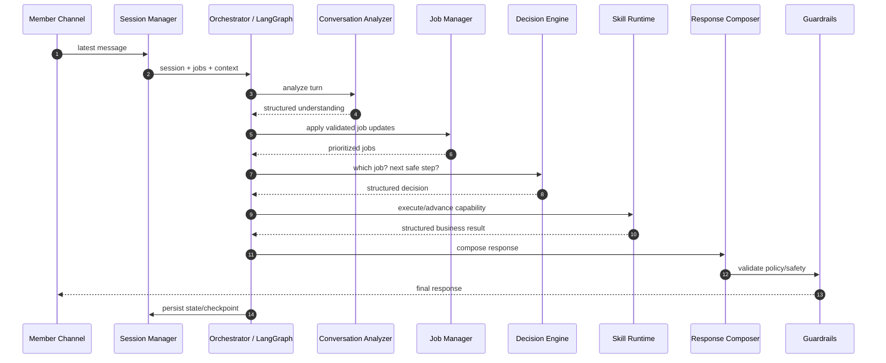

**Speaker notes:**
This is the runtime backbone. Whether the request is simple, multi-turn, interrupted, or escalated to a human, the platform uses the same lifecycle. That consistency is why it can be governed.

---

# Slide 8: Sequence 1 Single-Turn Objective

## Use case: "What's my checking balance?"

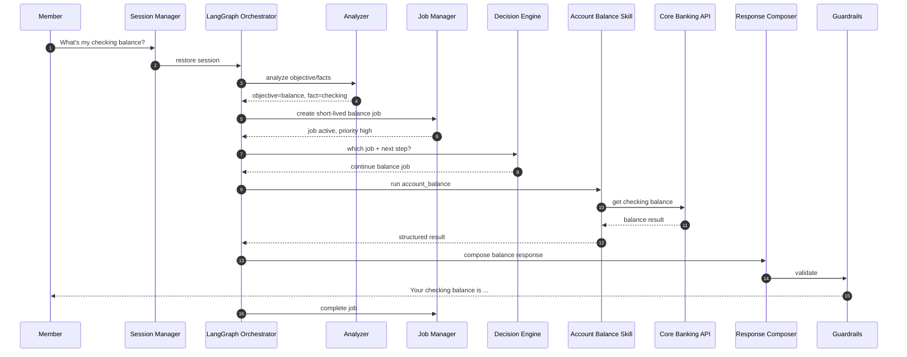

**Speaker notes:**
Even a simple one-turn answer follows the same lifecycle. The value is consistency, observability, and policy control without making the member feel the machinery.

---

# Slide 9: Sequence 2 Multi-Turn Guided Happy Path

## Use case: transfer money with progressive information gathering

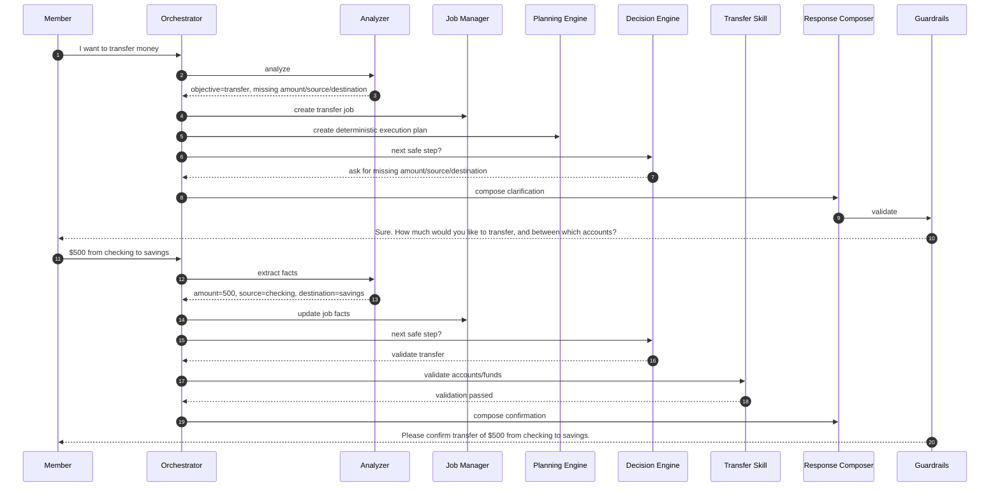

**Speaker notes:**
This is not old slot filling with prettier prompts. The member can provide information naturally, in any order, or all at once. But once the transfer is ready, the deterministic plan controls validation and confirmation.

---

# Slide 10: Sequence 3 Interruption and Resume

## Interruptions do not break the conversation; they reprioritize jobs

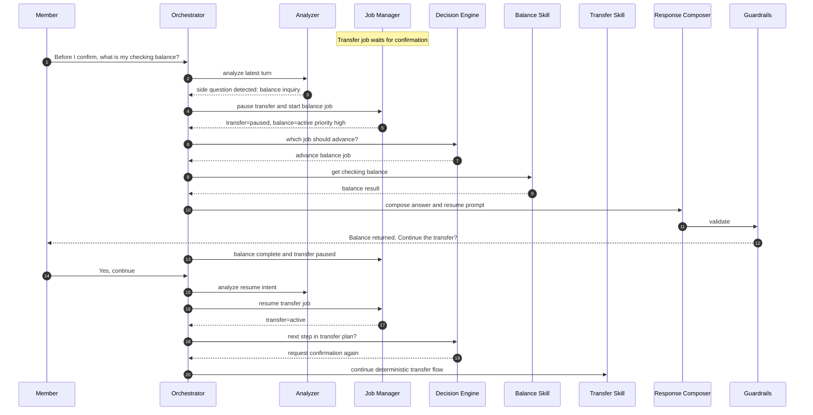

**Speaker notes:**
This is one of the most important slides. Traditional bots often treat this as an intent switch and lose the first flow. Our platform treats it as job prioritization. The transfer is paused, not forgotten.

---

# Slide 11: Sequence 4 Live-Agent Handoff

## Target state: human handoff is a platform capability, not a fallback after failure

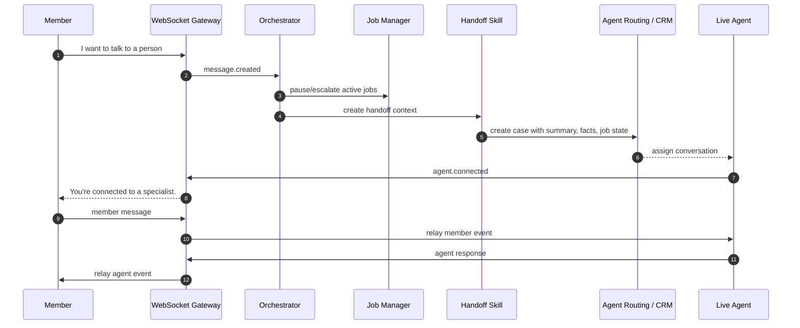

**Speaker notes:**
The live agent should not start blind. They receive the objective, active jobs, facts collected, tool outcomes, and reason for handoff. This is a better experience for both member and agent.

---

# Slide 12: Sequence 5 Complex Objective Decomposition

## Target state: one member objective can create multiple platform jobs

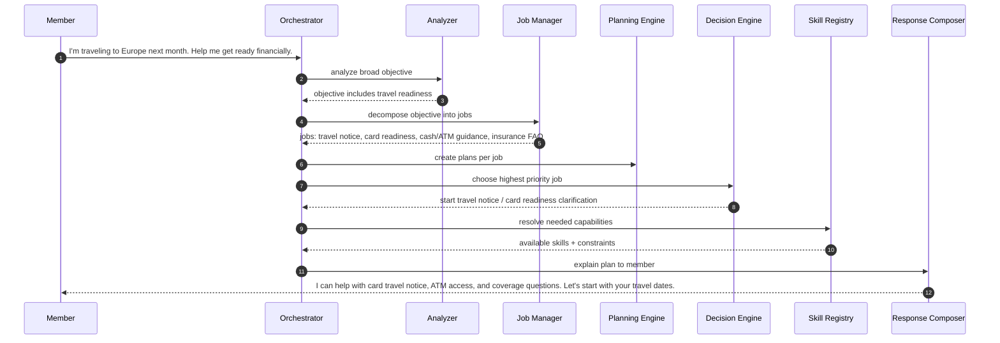

**Speaker notes:**
This is where the platform becomes more than a chatbot. A broad human objective can map to multiple jobs. The platform can explain progress and work through them in priority order.

---

# Slide 13: AWS Deployment and Guardrails

## Bedrock and guardrails sit behind platform-owned interfaces

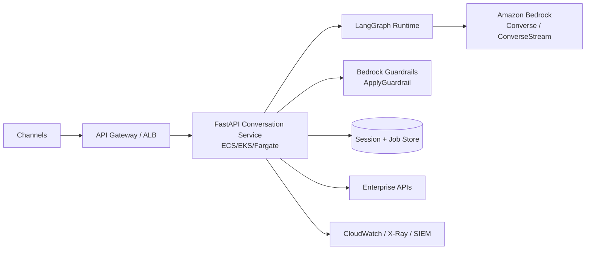

**Speaker notes:**
The model provider and guardrail provider are replaceable adapters. The platform should not put business logic inside Bedrock prompts. In the current POC, providers perform structured turn understanding; controlled templates and retrieved approved knowledge produce the member-facing unsupported/FAQ replies.

---

# Slide 14: What Changes for Business and Engineering

## From building every intent to governing reusable capabilities at scale

| Today | Future |
|---|---|
| Intent-by-intent design | Objective-driven conversation design |
| Slot prompts per flow | Progressive fact gathering |
| Code hooks per intent | Declarative skills + typed tools |
| Governance buried in code and prompts | Capability-owned declarations, platform-enforced controls |
| Intent switch loses context | Jobs pause, resume, reprioritize |
| Channel-specific behavior | Shared platform, channel-specific formatting |
| Prompt text buried in flows | Response contracts and templates |
| Hard to explain failures | Immutable version, risk tier, decision, tool, and outcome evidence |

**Speaker notes:**
This is the payoff slide. The platform helps business add capabilities faster
without asking the platform team to add bespoke orchestration for every use
case. It also gives risk, security, and audit teams a consistent control story:
the skill artifact says what the capability is allowed to do; the platform says
whether it may do it now; the trace proves what occurred. This is federated
governance, not decentralized enforcement.

---

# Slide 15: Closing Principles

## The architecture in one slide

1. Members express objectives.
2. The platform creates one or more jobs.
3. Each job owns an execution plan.
4. The Decision Engine advances the right job each turn.
5. Skills declare risk tier, execution mode, and permitted controls.
6. The platform validates, enforces, and audits those declarations.
7. Response Composer shapes the experience.
8. The model advises; the platform decides and persists.

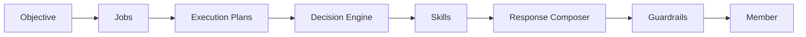

**Final message:**
This is not just a smarter bot. It is a governed conversation platform where
business capability ownership can scale without decentralizing control.

**Speaker notes:**
End with confidence. The business hears improved experience and reuse. Architects hear explicit state, policy, and deterministic execution. Engineers hear clear boundaries and incremental implementation.

---

# Slide 16: What Is Working Now

## The POC already proves the conversation-first control loop

| Demonstrated now | Evidence in the runtime |
|---|---|
| Natural objective recognition | Typed goal/slot understanding, then routing only to active catalog skills |
| Friendly, bounded lane-setting | Controlled response copy; unsupported requests are not answered from model memory |
| Three execution modes | Approved-knowledge FAQ, guided balance, deterministic internal transfer |
| Context continuity | Durable active, queued, and paused tasks; interruption, resume, discard, and slot correction |
| Safe action | Authentication/authorization gates and explicit transfer confirmation before the mock submission |
| Federated governance | Skills declare risk tier, approved tools, access, confirmation, and failure behavior; the catalog and runtime validate/enforce the supported combinations |
| Runtime extensibility | Versioned `SKILL.md` artifact can be activated without graph recompilation or process restart |

**Speaker notes:**
Be precise: this is a working Python/FastAPI/LangGraph POC with SQLite and mock
enterprise tools. It is intentionally smaller than the target deployment, but
the behavioral controls are real and testable.

---

# Slide 17: Controlled Answer Boundary

## The model can understand a turn; only a governed capability can complete it

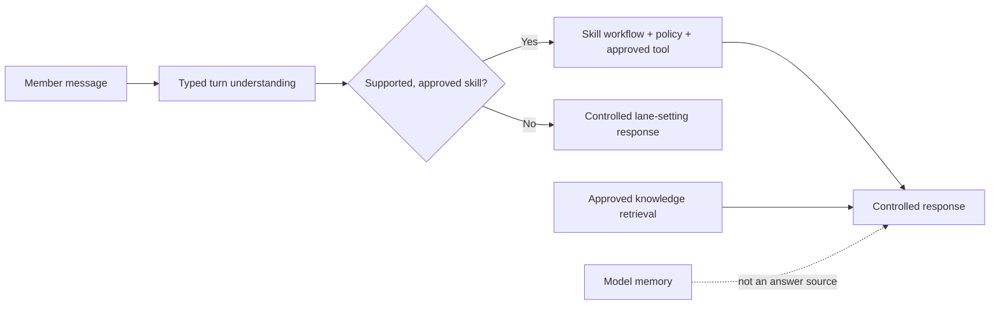

**Key message:** Conversational understanding is not permission to answer or act.

**Speaker notes:**
For the FAQ demo, the answer comes from approved retrieval and includes source
metadata. For an unsupported request, the assistant stays respectful, explains
its available help, and does not invent a financial answer.

---

# Slide 18: Live Demo Sequence

## Show the member experience, then reveal the controls

1. `Hi` — friendly capability-aware greeting.
2. An unsupported casual request — respectful, in-lane response.
3. Four unsupported turns — offer, but do not automatically start, live-agent handoff.
4. `I need to report fraud on my account` — explicit skill gap, audited, and immediately offered a governed live-agent handoff; no improvised fraud answer.
5. `How does overdraft protection work?` — approved, source-grounded FAQ.
6. `What's my balance?` then `checking` — guided collection and read-only result.
7. `Transfer $50 from checking to savings` then `yes` — deterministic review and confirmation.
8. Show the skill contract and trace for that transfer — `risk_tier=consequential`, required authorization, confirmation, approved tool, immutable version, and auditable outcome.
9. Interrupt a transfer with `What's my checking balance?`, then `resume` — pause and continue the exact prior task.
10. `Check my checking balance and transfer $25 from checking to savings` — risk-aware multi-goal ordering.
11. Change a transfer amount at review — slot correction causes a fresh confirmation.
12. Register the online-ID skill, repeat `I forgot my online ID` — capability becomes routable without restart.

**Speaker notes:**
Use a fresh session per scenario. The default four-turn threshold is measured
since the last supported goal; casual greetings do not reset it. Configure
`HANDOFF_OFFER_TURN_THRESHOLD` per environment if a different threshold is
required. Show
the catalog revision before and after online-ID activation if time allows.
