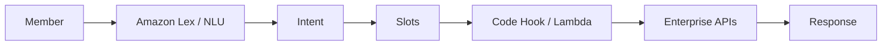
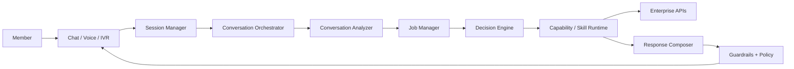
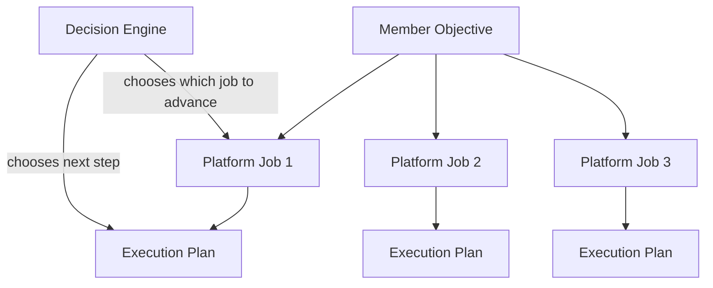
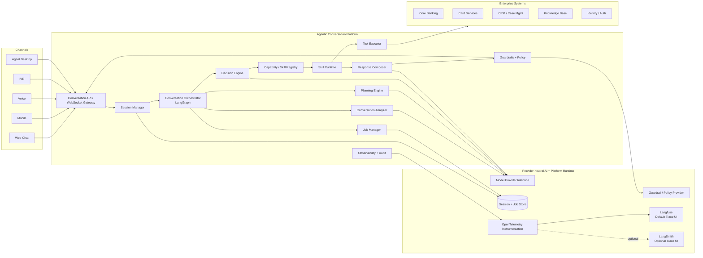
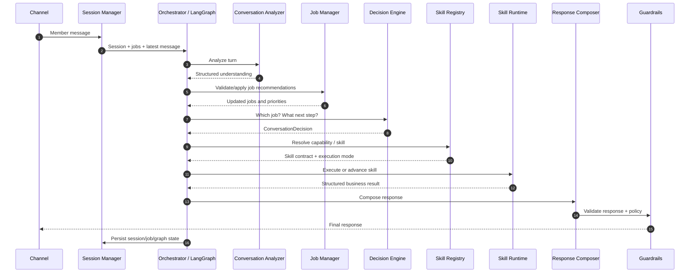
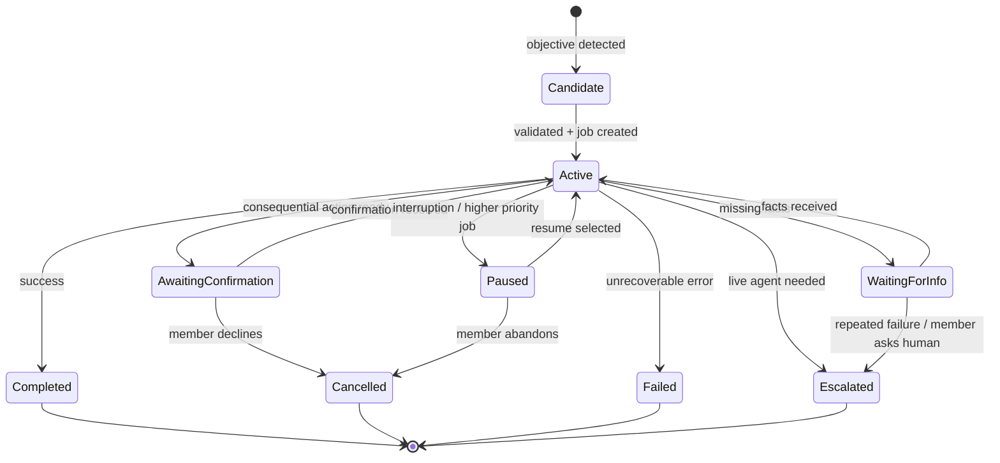
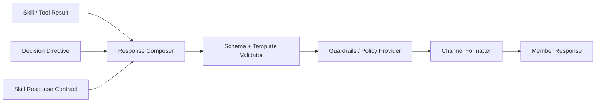
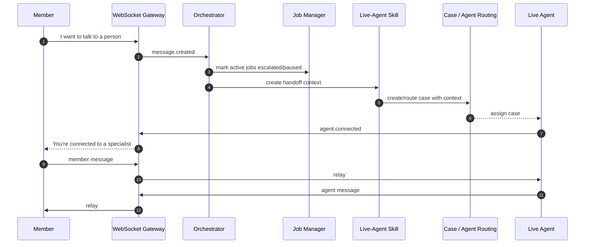
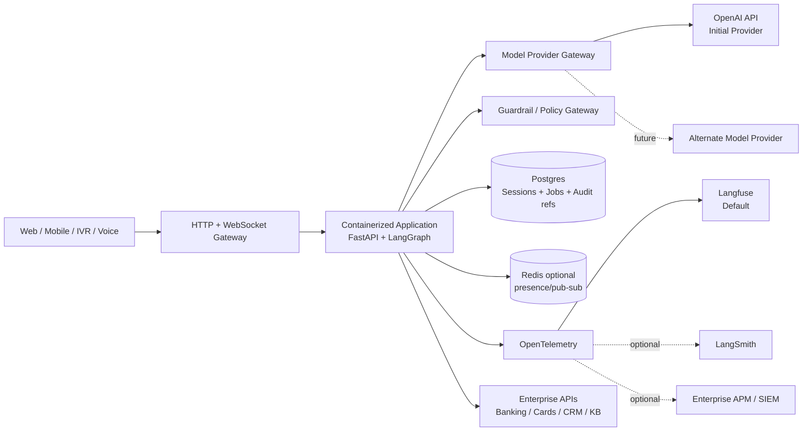

# Agentic Conversational Platform Architecture

**Status:** Draft v3 — target architecture, reconciled to the current POC (August 2026)  
**Audience:** Business, enterprise architecture, AI platform, application engineering, security/risk, QA  
**Deployment target:** Vendor-agnostic; local/container first, deployable to AWS/Azure/GCP/on-prem  
**Primary runtime:** Python, FastAPI/WebSockets, LangGraph, provider-neutral AI/guardrail/observability interfaces  
**Initial model provider:** OpenAI via `OPENAI_API_KEY` and the Responses API  
**Current observability:** provider-neutral console, in-memory test, and optional Langfuse/OpenTelemetry sinks; content is redacted by default  
**Architecture style:** Objective-driven conversation + platform-owned jobs + deterministic execution + declarative capabilities

---

## 1. Executive summary

This platform evolves the current intent-centric chatbot model into an **objective-driven agentic conversation platform**.

Traditional bots often work like this:

```text
member utterance -> intent classification -> slot elicitation -> code hook -> fulfillment
```

That model is predictable, but it becomes brittle when members speak naturally, interrupt a workflow, ask side questions, provide information out of order, or express a broad objective that does not map cleanly to one predefined intent.

The proposed platform works differently:

```text
member objective -> conversation understanding -> platform job(s) -> execution plan(s) -> governed capability execution -> composed response
```

The member owns the **objective**.  
The platform owns durable **jobs** created to satisfy that objective.  
Each job owns an **execution plan**.  
Each turn, the **Decision Engine** asks:

1. Which job should be advanced now?
2. What is the next safe step in that job's execution plan?

The LLM provides contextual understanding and recommendations. The platform owns state, governance, persistence, validation, execution, audit, and final policy enforcement.

> **Core principle: Conversationally adaptive, operationally governed.**

### 1.1 Current POC boundary

This document distinguishes the **target architecture** from the working POC in
this repository. The POC already proves the conversation-first control loop;
it is not yet a full enterprise job-management or agent-desktop platform.

| Area | Implemented now | Target-state extension |
|---|---|---|
| Conversation state | Durable SQLite session with one active task, queued tasks, paused tasks, pending clarifications, confirmation, and handoff state | Shared production-grade session/job store and cross-channel state |
| Orchestration | One stable LangGraph lifecycle: understand, plan, collect, policy, execute, advance, resume, finalize | Independently deployable planning and job-priority services where scale requires them |
| Understanding | Typed provider contract for goals, slot updates, conversation act, interruptions, and skill gaps; OpenAI, Bedrock, and deterministic adapters | Broader domain taxonomy, evaluations, and policy-aware ranking |
| Capabilities | Versioned `SKILL.md` catalog; declarative FAQ, guided balance, deterministic transfer, handoff; online-ID skill can be registered at runtime | Enterprise tool catalog, approval workflow, staged rollout, and richer capability types |
| Responses | Controlled templates for unsupported requests and deterministic actions; FAQ is rendered only from retrieved approved knowledge | Channel-specific rendering, localization, and approved response variants |
| Live support | Explicit confirmation then mock case creation with minimized summary | Contact-center routing, agent participant, queue status, and ownership transfer |

The POC deliberately does **not** answer unsupported financial questions from
model memory. A model may produce structured routing advice; it cannot directly
invoke a tool, mutate state, or generate the final unsupported/FAQ answer.

---

## 2. Why evolve from Lex-style intent architecture?

### 2.1 Current familiar pattern



This pattern is strong for known, narrow, deterministic flows. It gives clear fulfillment paths, explicit slot prompts, and predictable service calls.

### 2.2 Where it struggles

Intent-centric flows struggle when:

- the member expresses a broad objective instead of a known intent;
- a sentence contains multiple needs;
- the member answers indirectly or out of order;
- the member interrupts a transaction with a side question;
- the member changes their mind;
- intent classification is wrong but the meaning is obvious to a human;
- the bot abandons useful context when the intent changes.

### 2.3 Proposed pattern



The platform does **not** remove deterministic fulfillment. It moves natural-language understanding and conversation control into an adaptive layer while preserving governed execution.

---

## 3. Core language model for stakeholders

Use this language consistently.

| Term | Owner | Meaning |
|---|---|---|
| Objective | Member | What the member is trying to accomplish. It can be incomplete, broad, or ambiguous. |
| Job | Platform | A durable unit of work created to satisfy all or part of a member objective. |
| Execution plan | Job | The current steps to complete a job. It may be fixed, guided, or dynamically composed. |
| Capability / Skill | Platform | A reusable business capability such as balance inquiry, transfer, FAQ, or live-agent handoff. |
| Tool | Platform | A typed executable operation, usually an API adapter or deterministic function. |
| Decision | Platform-controlled model output | A structured recommendation for what should happen next. |
| Response | Platform | A composed, governed message returned to the channel. |

### 3.1 Avoid confusing language

Do not say:

> The LLM has goals.

Say:

> The member expresses objectives. The platform creates jobs. The model recommends next actions. The platform decides, persists, and executes.

### 3.2 The hierarchy



One objective may map to one job or many jobs. Each job has exactly one current execution plan, though the plan can evolve.

---

## 4. Architectural principles

### P1. Conversationally adaptive, operationally governed

The conversation can be flexible, contextual, and adaptive. Consequential execution remains validated, authorized, confirmed, idempotent, auditable, and policy controlled.

### P2. Model advises; platform decides and persists

The LLM can recommend interpretation, job creation, prioritization, skill selection, fact updates, and next action. It does not directly mutate official state. The platform validates and persists state transitions.

### P3. Members own objectives; platform owns jobs; jobs own execution plans

This is the core mental model.

### P4. Every turn asks two questions

The Decision Engine asks:

1. Which job should be advanced now?
2. What is the next safe step in that job's execution plan?

### P5. Skills declare execution mode

Every capability declares how it must execute:

| Mode | Use for | Behavior |
|---|---|---|
| Conversational | FAQ, education, low-risk guidance | Flexible, model-assisted, grounded, response-governed. |
| Guided | Account lookup, quote intake, claims intake | Progressive information gathering with deterministic validation. |
| Deterministic | Transfers, card lock/replace, profile changes | Fixed gates: authentication, authorization, validation, confirmation, audit. |

The planner does not improvise high-risk workflows. It selects the skill; the skill runtime enforces the declared mode.

### P6. Structured understanding, not hidden reasoning as control flow

Model outputs used for control flow must conform to typed contracts. Free-form text cannot directly drive state transitions.

### P7. Skills return business results; controlled response composition creates member experience

Business capabilities produce structured data. The current POC renders
unsupported replies, action prompts, and grounded FAQ answers from controlled
templates. FAQ text comes only from the retrieved approved source and retains
its source identifier/disclosure. A future response composer may add approved
channel variants, but it must never turn model memory into an answer source.

### P8. Guardrails are layered

Use guardrails at multiple stages:

- input safety and policy pre-checks;
- model output validation;
- tool permission checks;
- response safety/compliance validation;
- channel-specific rendering checks.

### P9. The orchestrator is generic

The orchestrator must not contain business-specific branching such as `if skill == transfer_money`. New skills are discovered through registries and specs.

### P10. Low-code means no orchestrator changes, not no engineering ever

A new skill can be added without central orchestrator changes when existing tool primitives and workflow primitives are sufficient. A new backend integration still needs a typed tool adapter.

---

## 5. Platform components



### 5.1 Session Manager

Owns conversation-level state:

- session ID;
- channel;
- member context reference;
- conversation history summary;
- active/paused/escalated mode;
- linked job IDs;
- live-agent connection state.

It does not decide business workflows.

### 5.2 Conversation Orchestrator

Coordinates the per-turn loop. Implement with LangGraph so the loop is explicit, inspectable, resumable, and testable.

Responsibilities:

- restore graph state;
- call analyzer / planner / decision nodes;
- route to skill runtime or response path;
- checkpoint after significant transitions;
- support interruptions and human-in-the-loop boundaries.

### 5.3 Conversation Analyzer

Uses a model to produce structured understanding of the latest turn:

- objective candidates;
- facts/entities;
- corrections;
- side question detection;
- sentiment/urgency signals;
- handoff request detection;
- safety/policy flags;
- recommendation only, not official state mutation.

### 5.4 Job Manager

Owns durable platform jobs.

**POC mapping:** this responsibility is represented by durable task state in
the conversation store (`active_task`, `queued_tasks`, `paused_tasks`) rather
than a separately deployed Job Manager. A task pins the skill version and
artifact hash so an in-flight request can complete after a catalog change.

Responsibilities:

- create jobs from validated objectives;
- decompose a complex objective into multiple jobs;
- maintain job status and priority;
- pause/resume/cancel/complete/escalate jobs;
- persist official job state;
- enforce job policies such as interruptible/non-interruptible.

### 5.5 Planning Engine

Creates or updates a job's execution plan.

Plan types:

- **static plan:** predefined workflow from a deterministic skill;
- **guided plan:** known stages with flexible fact collection;
- **dynamic plan:** a future model-assisted composition from allowed
  capabilities/tools, subject to policy.

The plan lives on the job record.

### 5.6 Decision Engine

Chooses what to advance on this turn.

Inputs:

- session state;
- job list;
- current execution plans;
- analyzer output;
- skill registry;
- policy state;
- latest user message.

Outputs a validated `ConversationDecision`.

### 5.7 Capability / Skill Registry

Loads declarative skill specs at startup or deployment time. Validates:

- schema correctness;
- referenced tools exist;
- declared execution mode is supported;
- required policies exist;
- response contract exists;
- tests are declared.

### 5.8 Skill Runtime

Executes a selected skill according to its declared mode. The runtime is generic and must not contain business-specific orchestration.

### 5.9 Tool Executor

Runs typed tools. It handles:

- authorization;
- input validation;
- idempotency;
- retries/timeouts;
- error mapping;
- audit events;
- correlation IDs.

### 5.10 Response Composer

Converts business data and decision directives into channel-appropriate member responses.

Responsibilities:

- enforce response schemas;
- apply business templates;
- include required disclosures;
- produce chat/voice/IVR variants;
- avoid exposing raw tool/model details;
- run validation before final guardrails.

**POC rule:** no free-form response composition is used for unsupported
requests or approved knowledge. These are controlled/template responses, with
the FAQ answer supplied by approved retrieval.

### 5.11 Guardrails + Policy

A layered, provider-neutral enforcement component. Business policy remains platform-owned; external safety services are adapters, not architectural dependencies.

Responsibilities:

- input safety and policy checks;
- prompt/output policy filtering;
- PII/sensitive-data handling;
- denied-topic and compliance checks;
- tool permission and transaction-policy checks;
- final response validation;
- block/redirect/escalate actions.

The first prototype may use local deterministic rules plus an optional OpenAI safety/moderation adapter. A future deployment can substitute enterprise guardrail services without changing orchestration, skills, or business logic.

### 5.12 Model Provider Gateway

All model access goes through a small platform-owned interface. Business components never import a vendor SDK directly.

Current implementation: OpenAI Responses API, Amazon Bedrock Converse, and a
deterministic provider for offline use or ordinary provider-availability
fallback. Bedrock guardrail interventions are terminal safety outcomes and do
not fall through to the deterministic provider.

Required provider capabilities:

- structured outputs for `ConversationDecision` and analyzer contracts;
- function/tool schemas when dynamic capability composition is enabled;
- optional source-bound or template-constrained language transformation only
  where an approved response policy permits it;
- streaming of member-facing controlled response parts where the channel supports it;
- timeout/retry/error normalization;
- model metadata and token usage for observability.

Prototype configuration:

```text
MODEL_PROVIDER=openai
OPENAI_API_KEY=...
OPENAI_MODEL=<configured model>
```

The OpenAI adapter should use the Responses API and schema-constrained outputs for control-flow decisions. The concrete model name must remain configuration, not business logic.

Suggested interface shape:

```python
class ModelProvider(Protocol):
    async def generate_structured(self, request, response_schema): ...
    async def generate_text(self, request): ...
    async def stream_text(self, request): ...
```

Future adapters may target another hosted model API, a cloud-managed model service, or a self-hosted model without changing Session Manager, Job Manager, Planning Engine, Decision Engine, Skill Runtime, or Response Composer.

### 5.13 Observability + Audit

Observability is provider-neutral and OpenTelemetry-first. Platform code emits traces/spans and correlation metadata through an `ObservabilityProvider`/OpenTelemetry layer; visualization backends are replaceable.

**Initial backend: Langfuse.** It is the reference trace UI for the prototype because it can visualize multi-step LLM/application traces, group activity by session, capture model/tool observations, and track token/cost metadata.

**Optional backend: LangSmith.** It may be enabled when teams want first-class LangGraph/LangChain trace visualization and debugging. The application must not depend on LangSmith-specific APIs for control flow.

Record at minimum:

- end-to-end `trace_id`, `session_id`, `objective_id`, `job_id`, and `plan_id`;
- LangGraph node entry/exit and duration;
- session state transitions;
- job lifecycle and priority transitions;
- model provider/model name, latency, token usage, and cost metadata;
- analyzer, planner, and decision structured outputs;
- schema-validation outcomes;
- capability/skill selection;
- tool calls, retries, failures, and idempotency keys;
- policy/guardrail outcomes;
- Response Composer and response-validation stages;
- human handoff events;
- channel latency and end-to-end latency.

Do not send secrets, authentication tokens, raw account numbers, or prohibited member data to tracing backends. Redaction/masking must occur before export.

Suggested abstraction:

```python
class ObservabilityProvider(Protocol):
    def start_trace(self, *, session_id, metadata): ...
    def span(self, name, *, attributes=None): ...
    def record_model_usage(self, usage): ...
    def record_event(self, name, payload): ...
```

Preferred implementation strategy:

```text
Application / LangGraph
        |
        v
OpenTelemetry instrumentation
        |
        +----> Langfuse (default)
        |
        +----> LangSmith (optional)
        |
        +----> Enterprise APM/SIEM (optional)
```

---

## 6. Per-turn lifecycle



---

## 7. Job lifecycle



### 7.1 Job priority

Priority is assigned at the job level, not the plan level.

Priority inputs:

- member's latest request;
- urgency/safety/compliance;
- side-question classification;
- job interruptibility;
- explicit member preference;
- policy gates;
- live-agent request.

---

## 8. ConversationDecision contract

The model must output structured JSON. The platform validates it before state changes.

```json
{
  "decision_type": "SUSPEND_AND_START",
  "target_job_id": "job_transfer_123",
  "new_job": {
    "objective_summary": "Check checking account balance",
    "candidate_skill_id": "account_balance",
    "priority": 90
  },
  "fact_updates": {
    "account_type": "checking"
  },
  "missing_information": [],
  "requires_confirmation": false,
  "response_directive": "Answer balance question, then offer to resume transfer.",
  "confidence": 0.91,
  "rationale_summary": "Member asked a side question during active transfer. Balance inquiry is read-only and should temporarily interrupt transfer."
}
```

### 8.1 Decision types

- `ANSWER_DIRECT`
- `ASK_CLARIFYING`
- `START_JOB`
- `CONTINUE_JOB`
- `SUSPEND_AND_START`
- `RESUME_JOB`
- `CANCEL_JOB`
- `REPLACE_JOB`
- `UPDATE_FACTS`
- `REQUEST_CONFIRMATION`
- `HANDOFF_LIVE_AGENT`
- `COMPLETE_JOB`
- `DECLINE_OR_BLOCK`

---

## 9. Skill specification model

Each skill is declarative.

```yaml
id: money_transfer
version: 1.0.0
domain: banking
name: Money Transfer
execution_mode: deterministic

objective_examples:
  - move $500 from checking to savings
  - transfer money to my son

facts:
  required:
    - source_account
    - destination_account
    - amount
  optional:
    - memo

allowed_tools:
  - list_accounts
  - validate_transfer
  - create_transfer

workflow:
  mode: deterministic
  steps:
    - collect_required_facts
    - validate_accounts
    - validate_funds
    - request_explicit_confirmation
    - execute_idempotent_transfer
    - audit_completion

policy:
  requires_authentication: true
  requires_confirmation: true
  interruptible_before_confirmation: true
  interruptible_after_confirmation: false

response_contract:
  schema: transfer_response_v1
  templates:
    ask_missing_amount: "How much would you like to transfer?"
    confirmation: "Please confirm: transfer {amount} from {source_account} to {destination_account}."
    success: "Done — I transferred {amount} from {source_account} to {destination_account}."
```

---

## 10. Response composition and guardrails

### 10.1 Response pipeline



### 10.2 Response modes

| Response type | Example | Enforcement |
|---|---|---|
| Template-only | Transfer confirmation | Deterministic template, no free-form generation. |
| Template-only | Balance response | Controlled template populated only by authorized tool results. |
| Grounded answer | FAQ | Render only from approved retrieved knowledge; retain source/disclosure. |
| Handoff summary | Live agent | Structured case/context summary. |
| Default fallback | Unsupported/general | Controlled lane-setting copy; no answer from model memory. |

The current POC uses the first, grounded-answer, handoff-summary, and default
fallback modes. A future schema-assisted mode needs an explicit response policy,
an allowlisted fact set, output validation, and a use case that does not permit
the model to supply financial facts from memory.

---

## 11. Live-agent handoff

Live-agent handoff is a first-class skill and platform mode.

### 11.1 Requirements

- Member may request a human at any point.
- Policy may force handoff.
- Repeated low-confidence clarification may trigger handoff.
- Current session, jobs, facts, tool outcomes, and transcript summary must be passed to the agent.
- WebSocket transport must support member and agent clients.
- The bot should stop autonomous execution once human-agent mode is active unless explicitly configured for assistive mode.

**POC escalation rule:** an explicit member request or strong frustration offers
handoff immediately. Otherwise, the platform offers—not automatically starts—a
handoff after four unsupported turns since the last supported goal by default.
`HANDOFF_OFFER_TURN_THRESHOLD` makes the threshold environment-configurable.
The counter is durable and casual greetings do not reset it. An unambiguous,
safety-critical skill gap such as fraud reporting is acknowledged, audited as a
`skill_gap`, and offered the governed handoff immediately; no fraud workflow is
improvised until an approved fraud skill is registered.

### 11.2 WebSocket endpoints

Current POC member endpoint:

```text
/v1/sessions/{session_id}/stream
```

It accepts idempotent `member.message` events and emits durable ordered events,
including input/confirmation prompts and a completion event. Agent WebSocket
participation is a target-state capability, not an implemented POC endpoint.

### 11.3 Event envelope

```json
{
  "event_id": "evt_123",
  "session_id": "session_123",
  "type": "message.created",
  "actor": "member",
  "timestamp": "2026-08-14T23:00:00Z",
  "payload": {}
}
```

### 11.4 Handoff flow



---

## 12. Vendor-agnostic deployment view



### 12.1 Deployment principle

The application should run as ordinary containers and depend on interfaces rather than cloud-native model APIs. Infrastructure adapters may target AWS, Azure, GCP, or on-prem services, but the core domain and orchestration code must remain unchanged.

Recommended prototype:

- local Python environment or Docker Compose;
- FastAPI + WebSockets;
- LangGraph;
- OpenAI model adapter configured from `.env`;
- Postgres (SQLite is acceptable for the earliest local spike);
- optional Redis for WebSocket presence/pub-sub;
- OpenTelemetry instrumentation;
- Langfuse for trace visualization;
- mock enterprise APIs for banking/card/CRM use cases.

### 12.2 Provider abstraction rule

No component outside `providers/` may directly import or instantiate the OpenAI SDK, Langfuse SDK, LangSmith SDK, or a future cloud-model SDK. Provider-specific configuration and translation stay behind adapters.

---

## 13. Initial use cases

### 13.1 Account balance

- Objective: "What's my checking balance?"
- Jobs: one balance inquiry job.
- Execution mode: guided or deterministic read-only.
- Tools: list accounts, get balance.
- Response: schema-assisted; account and balance formatting controlled.

### 13.2 Money transfer

- Objective: "Move $500 from checking to savings."
- Jobs: one transfer job.
- Execution mode: deterministic.
- Required facts: source, destination, amount.
- Required gates: auth, account validation, funds validation, explicit confirmation, idempotent execution, audit.

### 13.3 FAQ / knowledge answer

- Objective: "What's the wire transfer cutoff time?"
- Jobs: optional short-lived FAQ job or direct answer.
- Execution mode: conversational with grounding.
- Required gates: approved knowledge source, response validation.

### 13.4 Interruption during transfer

- Objective 1: Transfer money.
- Job 1: transfer job active.
- Objective 2/side question: check balance.
- Job 2: balance inquiry job becomes higher priority.
- Behavior: pause transfer, answer balance, offer to resume transfer.

### 13.5 Live-agent handoff

- Objective: get human help.
- Job: live-agent handoff.
- Behavior: stop autonomous completion, create context summary, connect member and live agent through WebSocket.

---

## 14. Implementation roadmap

### Slice 1 — Platform skeleton

- FastAPI app;
- health endpoint;
- settings;
- domain models;
- session/job repositories;
- LangGraph graph skeleton;
- provider-neutral model gateway with OpenAI adapter and fake adapter for tests;
- guardrail interface with fake adapter;
- skill registry and YAML validation;
- baseline test harness.

### Slice 2 — Account balance

- account balance skill;
- fake banking tool adapter;
- clarification when account is ambiguous;
- response composer contract.

### Slice 3 — FAQ

- FAQ skill;
- approved knowledge adapter;
- grounded response composition;
- unsupported question fallback.

### Slice 4 — Money transfer

- deterministic transfer skill;
- multi-turn fact collection;
- validation gates;
- confirmation interrupt;
- idempotent execution.

### Slice 5 — Interruption/resume

- balance side question during transfer;
- job pause/resume state transitions;
- resume prompt.

### Slice 6 — Live agent

- WebSocket gateway;
- member and agent clients;
- handoff context;
- relay mode;
- reconnect handling.

### Slice 7 — Production hardening

- provider configuration and fail-safe behavior;
- durable Postgres/checkpoint persistence;
- OpenTelemetry tracing with Langfuse dashboards;
- optional LangSmith trace adapter for LangGraph-focused debugging;
- trace redaction/masking and retention policy;
- deployment IaC for the selected runtime environment;
- secrets management;
- security, privacy, and compliance review.

---

## 15. Acceptance criteria

1. The orchestrator is generic and does not branch on individual skill IDs.
2. New skills can be loaded declaratively when existing tools are sufficient.
3. All model decisions are structured and validated.
4. Session and job state are explicitly persisted.
5. Transfers cannot execute without deterministic validation and explicit confirmation.
6. Interruptions pause and resume jobs rather than dropping state.
7. Response Composer and Guardrails are separate stages.
8. Live-agent handoff preserves context.
9. Tests cover single-turn, multi-turn, interrupted, handoff, and invalid-model-output scenarios.
10. No core domain/orchestration component directly imports a model-provider or observability-vendor SDK.
11. The OpenAI adapter can be replaced by a fake provider in tests without changing business components.
12. A complete member turn can be inspected in Langfuse from inbound message through LangGraph nodes, model calls, job transitions, tool calls, response composition, and guardrail outcome.
13. Sensitive member data is redacted before trace export.
14. Architecture diagrams and implementation remain aligned.

---

## 16. Reference notes

This architecture intentionally uses LangGraph as the orchestration/runtime layer while keeping model providers, guardrails, persistence, and observability replaceable behind platform-owned interfaces. The first working prototype uses OpenAI because an API key is available, and Langfuse is the default trace/visualization backend through OpenTelemetry. These are initial adapters, not architectural dependencies.

Current implementation assumptions are consistent with the following upstream capabilities: OpenAI supports schema-constrained structured outputs and function/tool calling; LangGraph provides persistence, durable execution, and interrupt/resume patterns; Langfuse supports OpenTelemetry-based LLM/application tracing and LangChain/LangGraph integrations; LangSmith can also visualize LangGraph traces.
