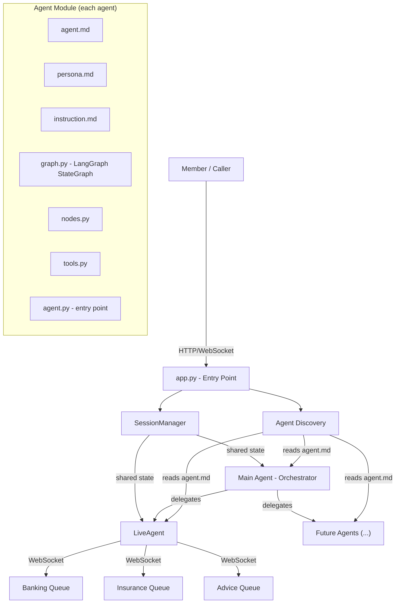
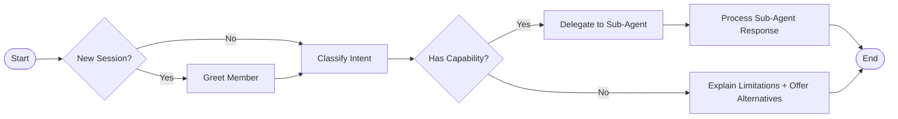
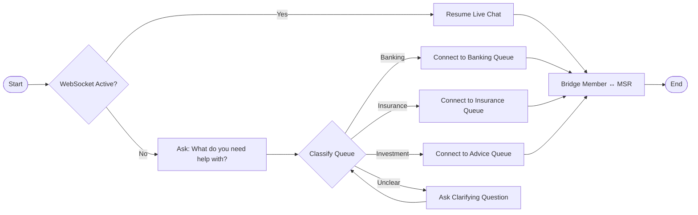

# Nexus — Product Requirements Document (PRD)

## Multi-Agent Conversational AI Platform for Financial Services

**Version:** 0.3.0-final-draft
**Date:** 2026-04-28
**Status:** Final Draft — Ready for Approval

---

## 1. Vision & Problem Statement

Financial institutions need a conversational AI platform that can handle diverse member interactions — from simple greetings to complex routing to live human agents across banking, insurance, and investment lines of business. Today, these capabilities are siloed, brittle, and hard to extend.

**Nexus** is a fully agentic, orchestrator-based chatbot platform where:
- A **Main Agent (Orchestrator)** greets members, discovers its own capabilities dynamically, and routes to specialized sub-agents
- **Sub-Agents** are independent, self-describing modules that can be developed, tested, and eventually hosted independently
- **Agent discovery** is spec-driven: each agent publishes an `agent.md` manifest that the orchestrator reads at startup
- **Session state** is shared across agents with **isolated conversation histories** — each agent maintains its own history and receives a **summary** on delegation handoffs

---

## 2. Design Principles

| Principle | Description |
|-----------|-------------|
| **Spec-Driven** | Every agent is described by specs (`agent.md`, `persona.md`, `instruction.md`) before any code is written |
| **Self-Describing** | Agents expose their capabilities via `agent.md` — the orchestrator never hardcodes sub-agent knowledge |
| **Independent Modules** | Each agent is a standalone module with its own graph, state, tools, and LLM config |
| **Isolated Histories** | Each agent owns its conversation history; delegation produces a summary handoff |
| **Graceful Degradation** | If a capability doesn't exist, the orchestrator acknowledges the ask and offers what it *can* do |
| **LangGraph-Native** | Every agent is a LangGraph `StateGraph` with explicit nodes, edges, and state |
| **Single LLM Provider** | AWS Bedrock with Amazon Nova Pro as the default model |

### 2.1 Development Workflow — Specs First

> **Cardinal Rule: No code without a blueprint.**

The development lifecycle follows a strict two-tier spec model. Every feature progresses through these stages in order:

```
Feature Spec (business) → Blueprint (technical) → Code → Tests
```

| Rule | Description |
|------|-------------|
| **Feature Spec → Blueprint → Code → Tests** | Every feature must have an approved feature spec before a blueprint is written. Every blueprint must exist before code is written. |
| **No code without a blueprint** | Implementation MUST reference a blueprint spec. Code files should include `Implements: blueprints/...` in their docstring. |
| **Blueprints map to implementation files** | Each blueprint describes the interface contract, data models, and acceptance criteria for a specific module or component. One blueprint per implementation file (e.g., `graph.spec.md` → `graph.py`). |
| **Feature specs may lead blueprints** | Feature specs can be written ahead of implementation. Blueprints are created when implementation is imminent. |
| **Verify before implementing** | Before starting implementation of any feature, verify that the corresponding blueprint(s) exist. If not, create them first. |
| **Large features use folders** | Features or components that span multiple specs should use a folder (e.g., `specs/features/main_agent/`, `specs/blueprints/main_agent/`) with individual spec files inside. |
| **Use templates** | All specs and blueprints must be created from their respective templates (`specs/features/_template.md`, `specs/blueprints/_template.md`). |
| **Use scaffolding for agents** | New agents must be created via `scripts/create_agent.py` to ensure consistent file structure and automatic discoverability. |

---

## 3. Architecture Overview



### Orchestration Pattern: Hierarchical Delegation

```
Member says: "I want to talk to someone about my insurance claim"

1. app.py → SessionManager: get/create session
2. app.py → MainAgent.invoke(session_state)
3. MainAgent LLM + tools: reasons "member wants live help" → calls delegate_to_agent("live_agent")
4. MainAgent: check capabilities → LiveAgent exists ✓
5. MainAgent → generates summary → LiveAgent.invoke(session_state)
6. LiveAgent LLM + tools: asks qualifying questions → calls connect_to_queue("insurance")
7. LiveAgent: WebSocket bridge member ↔ MSR
```

### When Capability is Missing

```
Member says: "I want to open a new savings account"

1. MainAgent LLM + tools: reasons "member wants account opening" → no matching skill found
2. MainAgent: no agent has this skill ✗
3. MainAgent responds:
   "I understand you'd like to open a new savings account.
    I'm still learning that capability. Here's what I can help with today:
    • Connect you with a live agent (Banking, Insurance, or Investment)
    Let me know if any of these would help!"
```

---

## 4. Project Structure

```
nexus/
├── app.py                          # Application entry point
├── config.py                       # Global config (Bedrock, session, etc.)
├── requirements.txt
├── pyproject.toml
├── README.md
│
├── core/
│   ├── __init__.py
│   ├── session.py                  # SessionManager + SessionState
│   ├── discovery.py                # Agent discovery (reads agent.md files)
│   ├── llm.py                      # Bedrock/Nova Pro client wrapper
│   ├── base_agent.py               # Abstract base agent class
│   └── types.py                    # Shared types, enums, contracts
│
├── agents/
│   ├── main_agent/                 # Orchestrator Agent
│   │   ├── agent.md                # Capability manifest
│   │   ├── persona.md              # Personality & tone
│   │   ├── instruction.md          # Behavioral instructions
│   │   ├── agent.py                # Agent entry point
│   │   ├── graph.py                # LangGraph StateGraph definition
│   │   ├── nodes.py                # Graph node functions
│   │   ├── tools.py                # Tools (discover_capabilities, delegate, etc.)
│   │   ├── state.py                # Agent-specific state schema
│   │   └── __init__.py
│   │
│   ├── live_agent/                 # Live Agent Routing
│   │   ├── agent.md
│   │   ├── persona.md
│   │   ├── instruction.md
│   │   ├── agent.py
│   │   ├── graph.py
│   │   ├── nodes.py
│   │   ├── tools.py
│   │   ├── state.py
│   │   └── __init__.py
│   │
│   └── _template/                  # Template for scaffolding new agents
│       ├── agent.md.template
│       ├── persona.md.template
│       ├── instruction.md.template
│       ├── agent.py.template
│       ├── graph.py.template
│       ├── nodes.py.template
│       ├── tools.py.template
│       ├── state.py.template
│       └── __init__.py.template
│
├── contact_center/                 # Mock contact center (console-based)
│   ├── server.py                   # WebSocket server with 3 queues
│   ├── msr_console.py             # MSR (Member Service Rep) console app
│   └── README.md
│
├── scripts/
│   ├── create_agent.py             # Scaffolding script: creates new agent from template
│   └── run_contact_center.py       # Starts the mock contact center
│
└── tests/
    ├── __init__.py
    ├── test_session.py
    ├── test_discovery.py
    ├── test_main_agent.py
    ├── test_live_agent.py
    └── conftest.py
```

---

## 5. Component Specifications

### 5.1 `app.py` — Application Entry Point

**Responsibilities:**
1. Accept `member_id` as CLI argument (default: `"member_default"`)
2. Initialize configuration (Bedrock client, session store)
3. Run agent discovery — scan `agents/*/agent.md` to build capability registry
4. Start a REPL-style conversation loop
5. For each member turn:
   - Pass message + session state to the currently active agent
   - Display: agent response, current state summary, and LLM reasoning
   - Update session

```python
# Usage: python app.py --member-id M12345
# Usage: python app.py  (uses default member_id)

def main(member_id: str = "member_default"):
    config = load_config()
    llm_client = create_bedrock_client(config)
    capabilities = discover_agents("agents/")
    session_mgr = SessionManager()

    session = session_mgr.get_or_create(member_id)
    main_agent = MainAgent(llm_client, capabilities, session)

    while True:
        user_input = input("You: ")
        result = main_agent.invoke(user_input)

        # Display response
        print(f"Nexus: {result.response}")

        # Display transparency info (debug panel)
        print(f"  [agent: {result.active_agent}]")
        print(f"  [reasoning: {result.llm_reasoning}]")
        print(f"  [state: {result.state_snapshot}]")
```

### 5.2 `core/session.py` — Session Management

**SessionState** is the shared communication bus between all agents. Each agent maintains its **own conversation history** — there is no single shared history.

```python
@dataclass
class AgentState:
    conversation_history: List[Message]  # This agent's own conversation turns
    delegation_summary: Optional[str]    # Summary received when delegated to
    data: Dict[str, Any]                 # Agent-specific working data

@dataclass
class SessionState:
    session_id: str                      # UUID
    member_id: str                       # Unique member identifier
    created_at: datetime
    last_active: datetime
    is_new_session: bool                 # True if first interaction
    current_agent: str                   # Which agent is currently active
    agent_states: Dict[str, AgentState]  # Per-agent isolated state
    context: Dict[str, Any]             # Shared context (intent, entities, etc.)
    metadata: Dict[str, Any]            # Extensible metadata

class SessionManager:
    def get_or_create(self, member_id: str) -> SessionState: ...
    def update(self, session: SessionState) -> None: ...
    def get(self, session_id: str) -> Optional[SessionState]: ...
```

**Key Design Decisions:**
- **No shared conversation history.** Each agent has its own `conversation_history` inside `agent_states[agent_name]`
- On delegation, the source agent generates a **summary** of the conversation so far and passes it as `delegation_summary` to the target agent
- `context` is the shared namespace — agents write intents, entities, routing decisions here
- No agent should directly modify another agent's `AgentState`
- v1 uses in-memory storage; future: DynamoDB or Redis
- Default `member_id` is `"member_default"` when no auth is configured

### 5.3 `core/discovery.py` — Agent Discovery

Reads `agent.md` from each agent directory and builds a capability registry.

```python
@dataclass
class Skill:
    name: str                   # e.g., "connect_to_live_agent"
    description: str            # e.g., "Connect member to a human representative"

@dataclass
class AgentCapability:
    name: str                   # e.g., "live_agent"
    display_name: str           # e.g., "Live Agent Support"
    description: str            # What this agent does
    skills: List[Skill]         # What this agent can do
    version: str
    status: str                 # "active" | "beta" | "disabled"

def discover_agents(agents_dir: str) -> List[AgentCapability]:
    """Scan agents/*/agent.md, parse YAML frontmatter, return capabilities."""
    ...
```

### 5.4 `core/llm.py` — Bedrock / Nova Pro Client

```python
class LLMClient:
    def __init__(self, model_id: str = "amazon.nova-pro-v1:0", region: str = "us-east-1"):
        self.client = boto3.client("bedrock-runtime", region_name=region)
        self.model_id = model_id

    def invoke(self, messages: List[Message], system_prompt: str = "") -> LLMResponse:
        """Plain conversation — text in, text out."""
        ...

    def invoke_with_tools(self, messages, system_prompt, tools) -> LLMResponse:
        """Conversation with tool definitions. LLM may respond with text
        OR request a tool call. The caller executes the tool and feeds
        the result back for a final response."""
        ...

@dataclass
class LLMResponse:
    text: str                           # LLM's text response (if any)
    tool_call: Optional[ToolCall]       # Tool call request (if any)
    reasoning: str                      # LLM's reasoning (extracted for debug panel)
```

### 5.5 `core/base_agent.py` — Abstract Base Agent

```python
class BaseAgent(ABC):
    def __init__(self, llm_client: LLMClient, session: SessionState):
        self.llm = llm_client
        self.session = session
        self.persona = self._load_md("persona.md")
        self.instructions = self._load_md("instruction.md")

    @abstractmethod
    def build_graph(self) -> StateGraph:
        """Each agent defines its own LangGraph."""
        ...

    @abstractmethod
    def invoke(self, user_input: str) -> str:
        """Process user input, return response."""
        ...

    def get_system_prompt(self) -> str:
        """Combine persona + instructions + context into system prompt."""
        ...
```

### 5.6 Skills vs Tools — Conceptual Model

**Skills** and **Tools** serve different purposes and live in different places:

| Concept | What It Is | Where It Lives | Who Reads It |
|---------|-----------|---------------|-------------|
| **Skill** | What an agent CAN DO (external contract) | `agent.md` | Orchestrator discovery |
| **Tool** | Function the LLM can CALL to do work (internal mechanism) | `tools.py` | LLM via function calling |

**Analogy:** Skills = the restaurant menu (what's offered). Tools = the kitchen equipment (how it's made).

**Relationship:** The orchestrator reads all agents' skills → builds its `delegate_to_agent` tool dynamically from them → sends to LLM → LLM reasons about which agent to route to.

A single skill may require multiple tools internally. Example:
- Skill (in `agent.md`): `setup_payment` — "Help member set up a new payment method"
- Tools (in `tools.py`): `validate_account()`, `create_payment_method()`, `send_confirmation()`

### 5.7 Why LangGraph (Rationale)

LangGraph is the **standard pattern for all agents** — even simple ones.

**What it gives us:**
- Explicit state machine with nodes and edges — visual, debuggable
- Built-in state management via TypedDict
- Conditional routing between nodes
- Checkpointing (resume from any point)
- Human-in-the-loop support (critical for LiveAgent)
- Subgraph composition (orchestrator calling sub-agent graphs)

**Simple agents get simple graphs:**
```
START → process → END          # FAQ agent — basically a ReAct loop in graph form
```

**Complex agents get complex graphs:**
```
START → check_session → greet → classify → [route] → delegate/decline → END
```

The cost for simple agents is ~5 lines of boilerplate. The benefit is every agent has the same structure — consistent pattern, easy to extend, uniform debugging.

---

## 6. Agent Specifications

### 6.1 Main Agent (Orchestrator)

#### `agents/main_agent/agent.md`
```yaml
---
name: main_agent
display_name: "Nexus Assistant"
description: "Primary orchestrator that greets members, discovers available skills across all agents, and delegates to the right agent."
skills:
  - name: greeting
    description: "Welcome new and returning members"
  - name: capability_inquiry
    description: "Explain what services are currently available"
  - name: delegate_to_agent
    description: "Route member to a specialized agent based on their need"
version: "1.0.0"
status: active
---

# Main Agent — Nexus Assistant

The orchestrator agent. Handles initial contact, session management,
skill discovery, and delegation to sub-agents.
```

#### LangGraph Definition



**Nodes:**
| Node | Description |
|------|-------------|
| `check_session` | Check if session is new, set `is_new_session` flag |
| `greet` | Welcome message using persona, explain available skills |
| `process` | LLM call with tools — LLM reasons and decides: respond directly or call a tool |
| `route` | Conditional edge — based on LLM's tool call decision |
| `delegate` | Generate summary, instantiate sub-agent, pass session state, invoke |
| `no_capability` | Craft helpful decline message with available skills |
| `handle_response` | Process sub-agent response, update session, return to member |

**Tools (via `@tool` decorator):**
```python
# main_agent/tools.py
from langchain_core.tools import tool

@tool
def delegate_to_agent(agent_name: str, skill: str, reason: str) -> str:
    """Route member to a specialized agent.

    Args:
        agent_name: Name of the agent to delegate to
        skill: The specific skill being requested
        reason: Why this delegation is happening
    """
    ...

@tool
def show_capabilities() -> str:
    """List all available skills across all agents in a readable format."""
    ...
```

The `delegate_to_agent` tool's `agent_name` enum and descriptions are **dynamically built** from discovered `agent.md` skills at startup.

### 6.2 Live Agent (Contact Center Routing)

#### `agents/live_agent/agent.md`
```yaml
---
name: live_agent
display_name: "Live Agent Support"
description: "Connects members to live human agents in Banking, Insurance, or Investment Advice queues via real-time chat."
skills:
  - name: connect_to_live_agent
    description: "Connect member to a human representative in Banking, Insurance, or Advice queue"
version: "1.0.0"
status: active
---

# Live Agent — Contact Center Routing

Routes members to the appropriate contact center queue based on
their needs. Supports Banking, Insurance, and Advice queues.
```

#### LangGraph Definition



**Nodes:**
| Node | Description |
|------|-------------|
| `check_connection` | Check if an active WebSocket connection exists in agent state |
| `ask_reason` | Ask member what they need to speak to a live agent about |
| `classify_queue` | LLM call to determine queue: banking, insurance, or advice |
| `clarify` | Ask follow-up if queue can't be determined |
| `connect_to_queue` | Establish WebSocket connection to appropriate queue |
| `bridge_chat` | Relay messages between member and MSR in real-time |

**Tools (via `@tool` decorator):**
```python
# live_agent/tools.py
from langchain_core.tools import tool

@tool
def connect_to_queue(queue_name: str) -> str:
    """Connect member to a contact center queue.

    Args:
        queue_name: The queue to connect to. Must be 'banking', 'insurance', or 'advice'.
    """
    ...

@tool
def disconnect() -> str:
    """Disconnect from the current live agent session."""
    ...
```

### 6.3 Agent Template Spec

Each new agent created via `scripts/create_agent.py` gets this structure:

| File | Purpose | Who Reads It |
|------|---------|-------------|
| `agent.md` | YAML frontmatter + markdown: name, skills, version, status | Orchestrator (discovery) |
| `persona.md` | Agent personality, tone, communication style | LLM (system prompt) |
| `instruction.md` | Behavioral rules, guardrails, edge case handling | LLM (system prompt) |
| `agent.py` | Entry point — extends `BaseAgent`, wires graph + tools | Runtime |
| `graph.py` | LangGraph `StateGraph` definition with nodes and edges | Runtime |
| `nodes.py` | Individual node functions (each is a pure function) | Runtime |
| `tools.py` | `@tool`-decorated functions — schema auto-generated from type hints + docstrings | LLM (function calling) + Runtime |
| `state.py` | Agent-specific `TypedDict` state schema for LangGraph | Runtime |
| `__init__.py` | Exports | Runtime |

---

## 7. Contact Center (Mock)

A console-based mock contact center for testing the LiveAgent.

### 7.1 `contact_center/server.py` — WebSocket Server

- Runs a `websockets` server on `localhost:8765`
- Manages 3 queues: `banking`, `insurance`, `advice`
- Routes incoming connections to the appropriate queue
- Maintains a queue of waiting members and available MSRs
- Matches members to MSRs and bridges their communication

### 7.2 `contact_center/msr_console.py` — MSR Terminal App

- Console application that an MSR runs to "work" a queue
- Usage: `python msr_console.py --queue banking --name "John"`
- Connects to the WebSocket server, registers as available MSR
- Receives member connections, chats in real-time
- Can handle one member at a time (v1)

### 7.3 Flow

```
Terminal 1: python scripts/run_contact_center.py      # Starts WS server on localhost:8765
Terminal 2: python contact_center/msr_console.py --queue banking --name "Alice"
Terminal 3: python contact_center/msr_console.py --queue insurance --name "Bob"
Terminal 4: python contact_center/msr_console.py --queue advice --name "Carol"
Terminal 5: python app.py --member-id M12345            # Member conversation
```

**Connection topology:**
```
LiveAgent ──WebSocket──► WS Server ◄──WebSocket── MSR Console
  (client)                (hub)                    (client)
```

**End-to-end scenario:**
```
[Terminal 5 - Member]
You: I want to talk to someone about my bank account
Nexus: I understand you'd like to speak with someone. Let me connect you to our live agent support.
  [Agent: main_agent → delegating to live_agent]

Nexus (live_agent): What would you like to discuss with our team?
You: I need help with a banking dispute
Nexus (live_agent): Connecting you to our Banking team. One moment...
  [WebSocket: live_agent connects to banking queue]

[Terminal 2 - MSR Alice]
>>> New member connected. Topic: banking dispute
Alice: Hi! I'm Alice from banking. How can I help with your dispute?

[Terminal 5 - Member]
Nexus (MSR Alice): Hi! I'm Alice from banking. How can I help with your dispute?
You: I see a charge I didn't make
  [Relayed to Alice]

[Terminal 2 - MSR Alice]
>>> Member: I see a charge I didn't make
Alice: /end  (MSR signals end)

[Terminal 5 - Member]
Nexus: Your live agent session has ended. Is there anything else I can help with?
  [Agent: live_agent → returned to main_agent]
```

---

## 8. Scaffolding Script

`scripts/create_agent.py` — Creates a new agent module from the template.

```
Usage: python scripts/create_agent.py <agent_name> [--display-name "..."] [--description "..."]

Example:
  python scripts/create_agent.py balance_inquiry \
    --display-name "Balance Inquiry" \
    --description "Checks account balances for banking members"

Creates:
  agents/balance_inquiry/
  ├── agent.md          (populated with name, display_name, description)
  ├── persona.md        (default template)
  ├── instruction.md    (default template)
  ├── agent.py          (extends BaseAgent, wired to graph)
  ├── graph.py          (minimal LangGraph with START → process → END)
  ├── nodes.py          (placeholder process node)
  ├── tools.py          (empty tools list)
  ├── state.py          (minimal TypedDict)
  └── __init__.py
```

---

## 9. Technology Stack

| Component | Technology | Rationale |
|-----------|-----------|-----------|
| Language | Python 3.11+ | LangGraph ecosystem, Bedrock SDK |
| LLM | Amazon Nova Pro (via Bedrock) | Cost-effective, tool-calling support |
| Agent Framework | LangGraph | Explicit state machines, debuggable graphs |
| WebSocket | `websockets` library | Lightweight, async, stdlib-compatible |
| Session Storage | In-memory dict (v1) | Simple; upgrade path to DynamoDB/Redis |
| CLI Interface | Standard input/output (v1) | Simplest possible; upgrade path to FastAPI |
| Testing | pytest | Standard Python testing |

**AWS Dependencies:**
- `boto3` — Bedrock Runtime client
- AWS credentials configured via env vars or `~/.aws/credentials`
- Bedrock model access enabled for `amazon.nova-pro-v1:0`

---

## 10. Agent Communication Protocol

### 10.1 Delegation Contract

When the orchestrator delegates to a sub-agent:

```python
@dataclass
class DelegationRequest:
    source_agent: str           # "main_agent"
    target_agent: str           # "live_agent"
    user_input: str             # Original member message
    summary: str                # LLM-generated summary of conversation so far
    session: SessionState       # Full shared session
    context: Dict[str, Any]     # Additional context (classified intent, entities)

@dataclass
class DelegationResponse:
    agent_name: str             # "live_agent"
    response: str               # Message to show member
    status: str                 # "complete" | "in_progress" | "needs_input" | "error"
    summary: str                # Summary of what this agent accomplished
    session_updates: Dict       # Changes to write back to session
    return_to_orchestrator: bool  # True = hand control back to main_agent
```

### 10.2 Delegation Summary Flow

```
main_agent → live_agent:
  1. main_agent generates summary: "Member greeted. Wants to speak to a live agent about a banking dispute."
  2. Summary stored in session.agent_states["live_agent"].delegation_summary
  3. live_agent starts with its OWN empty conversation_history + the summary as context

live_agent → main_agent (return):
  1. live_agent generates summary: "Connected member to banking queue. MSR Alice handled dispute. Session ended by MSR."
  2. Summary stored in session.agent_states["main_agent"].delegation_summary
  3. main_agent resumes with its own history + the return summary
```

### 10.3 State Isolation Rules

- Each agent reads/writes ONLY to `session.agent_states[agent_name]`
- Each agent has its own `conversation_history` — never reads another agent's
- Shared data goes in `session.context` (intents, entities, routing)
- On delegation: source generates summary → target receives it as context
- No agent should directly modify another agent's `AgentState`

### 10.4 LiveAgent Session Lifecycle

The WebSocket connection between LiveAgent and an MSR follows these rules:

| Event | Action |
|-------|--------|
| Member connected to MSR | WebSocket open, bridge active |
| Member idle > 2 minutes | Auto-disconnect, notify MSR |
| Member leaves (no input > 2 min) | Auto-disconnect, notify MSR |
| MSR signals end | Disconnect, return to main_agent |
| Member wants different queue | Disconnect current, return to main_agent for re-routing |
| Member wants different help entirely | Disconnect, return to main_agent with summary |

When the LiveAgent session ends for any reason, control returns to the main_agent with a delegation summary.

---

## 11. Resolved Decisions

| # | Question | Decision |
|---|----------|----------|
| 1 | Agent hot-reload vs startup? | **v1: startup discovery.** Hot-reload planned for future. |
| 2 | LiveAgent session lifecycle? | **Open until: 2-min idle timeout, MSR signals end, or queue switch.** On end → return to main_agent with summary. |
| 3 | Conversation history scope? | **Per-agent isolated history.** Delegation generates a summary; target agent gets summary + its own fresh history. |
| 4 | Authentication? | **v1: default `member_id` via CLI arg.** Auth (OAuth/SSO) deferred. |
| 5 | Logging & observability? | **v1: basic Python logging.** Member console shows response + active agent + LLM reasoning + state snapshot per turn. |

> [!WARNING]
> **Bedrock Access:** This requires an AWS account with Bedrock access enabled for Nova Pro in your region. The `us-east-1` region is assumed. Confirm your region and model access.

## 12. Console Output Format (v1)

Every turn in the member CLI displays:

```
You: I want to talk to someone about my insurance

Nexus: I'll connect you with our live agent support to help with your insurance needs.

┌─ Debug ──────────────────────────────────────────────┐
│ Agent:     main_agent → live_agent (delegating)      │
│ Tool Call: delegate_to_agent(                        │
│              agent="live_agent",                      │
│              skill="connect_to_live_agent",           │
│              reason="Member wants to speak with       │
│                      human about insurance")          │
│ State:     {current_agent: "live_agent",              │
│             context: {skill: "connect_to_live_agent",│
│                       topic: "insurance"}}            │
└──────────────────────────────────────────────────────┘
```

This transparency is critical for v1 learning and debugging.

---

## 13. Non-Functional Requirements

| Requirement | Target |
|------------|--------|
| Response latency (LLM call) | < 3 seconds |
| Session timeout | 30 minutes of inactivity |
| LiveAgent idle timeout | 2 minutes |
| Concurrent sessions | 100+ (future, with proper storage) |
| Agent scaffolding time | < 30 seconds via script |
| Test coverage | > 80% for core modules |

---

## 14. Verification Plan

### Automated Tests
```bash
# Unit tests
pytest tests/ -v --cov=core --cov=agents

# Integration test — full conversation flow
pytest tests/test_main_agent.py::test_greeting_flow -v
pytest tests/test_main_agent.py::test_no_capability_flow -v
pytest tests/test_live_agent.py::test_queue_routing -v
```

### Manual Verification
1. Run `app.py`, verify greeting flow for new member
2. Run `app.py`, verify returning member resumes session
3. Ask for a capability that doesn't exist → verify graceful decline
4. Ask to speak to a live agent → verify queue classification
5. Run contact center + MSR consoles → verify end-to-end WebSocket bridge
6. Run `scripts/create_agent.py` → verify new agent is discovered on next startup

---

## 15. Milestones

| Phase | Deliverable | Dependencies |
|-------|------------|-------------|
| **Phase 1** | Core infrastructure: `session.py`, `discovery.py`, `llm.py`, `base_agent.py` | AWS credentials |
| **Phase 2** | Main Agent: greeting, skill-based routing, capability display | Phase 1 |
| **Phase 3** | Agent scaffolding: template + `create_agent.py` script | Phase 1 |
| **Phase 4** | Live Agent: queue classification, WebSocket routing | Phase 2 |
| **Phase 5** | Contact Center mock: server + MSR console | Phase 4 |
| **Phase 6** | Integration testing + polish | All phases |
