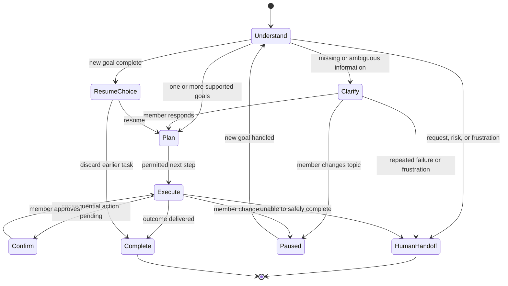
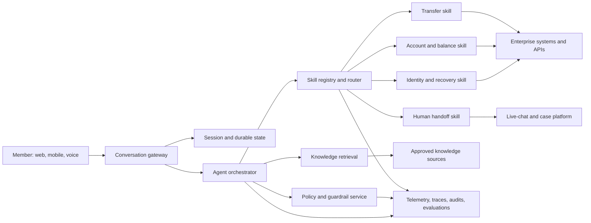

# Agentic Member Assistant POC: Architecture and Design Proposal

## Product and Architecture Proposal

**Audience:** business, product, risk, operations, engineering, and support teams  
**Purpose:** define a practical target for evolving a legacy intent-based chatbot into a secure, conversational, agentic member-assistance platform for banking, insurance, and financial-advice experiences.

## 1. Executive summary

The proposed platform combines a conversational AI layer with governed business **skills**. The AI understands what a member is trying to accomplish, manages conversation and clarifications, and chooses an approved skill. Skills retrieve knowledge, navigate the member to a trusted experience, or perform authorized actions through existing enterprise systems.

The design deliberately separates flexible language understanding from deterministic controls. Models do not become the system of record, decide authorization, or directly execute high-risk actions. Policy, authentication, authorization, confirmations, and audit requirements remain explicit platform controls.

The outcome is a member experience that is more natural than a legacy NLU bot while remaining scalable, maintainable, observable, safe, and business-manageable.

## 2. Goals

- Help members complete simple and complex banking, insurance, and advice journeys conversationally.
- Support one or several member goals in a single message.
- Ask concise clarifying questions when information is missing or ambiguous.
- Let members safely interrupt, resume, or abandon a task.
- Ground informational responses in approved enterprise knowledge.
- Escalate smoothly to a live human when requested, needed, or when frustration is detected.
- Make skills, knowledge, response templates, and policies manageable by accountable business owners.
- Produce privacy-safe operational evidence for every important decision and outcome.

## 3. Out of scope for the initial release

- Replacing core banking, insurance, identity, or case-management systems.
- Allowing a model to make regulated financial recommendations without approved suitability, disclosure, and supervision controls.
- Fully autonomous execution of irreversible or high-impact actions.

## 4. Core design principles

1. **Conversation is flexible; controls are deterministic.** The model may interpret language and plan the next step. Platform policy decides what is permitted.
2. **Skills are the product boundary.** Each capability has a named owner, versioned contract, approved integrations, response design, guardrails, and success measures.
3. **One safe action at a time.** A request may contain multiple goals, but consequential work is sequenced and confirmed immediately before execution.
4. **State is durable and inspectable.** Active goals, clarifications, approvals, and resumable work are stored outside the model context.
5. **Human support is a first-class outcome.** Escalation is not a failure; it is a deliberate experience with preserved context.
6. **Grounded answers only.** Policy and FAQ answers cite or derive from approved knowledge, not open-ended model memory.
7. **Business ownership without uncontrolled production changes.** Business teams manage approved content, templates, thresholds, and skill configuration through governed publishing workflows.

## 5. Representative member scenarios

| Scenario | Member example | Expected behavior | Key controls |
|---|---|---|---|
| Online ID recovery | “I forgot my online ID.” | Identify the recovery goal and offer the approved recovery journey or link. | Do not disclose identity data; use the approved identity-recovery flow. |
| Account balance | “What’s my account balance?” | Verify session eligibility, retrieve the relevant balance, and respond. Ask which account only when needed. | Authentication, authorization, data minimization, masking. |
| FAQ / policy answer | “How does this coverage work?” | Search approved knowledge and provide a templated, grounded answer. | Source quality, freshness, disclosures, no unsupported claims. |
| Multiple goals | “Check my balance and transfer from checking to savings.” | Extract a goal list; complete read-only work, then collect required transfer details and confirm before transfer. | Goal dependency order, confirmation, transaction limits, idempotency. |
| Interrupt and resume | A member changes topic while the assistant awaits an account selection. | Preserve the paused task, resolve the new request, then offer to resume or discard the earlier task. | Durable state, explicit resume choice, timeout rules. |
| Frustration and live support | “This is not helping—get me a person.” | Acknowledge, escalate to live chat or another approved channel, and transfer a concise case summary. | Immediate request handling, sentiment signals, human queue routing, consent and context transfer. |

## 6. Conversation behavior

### 6.1 Goal lifecycle

### 6.2 Multi-goal policy

The platform should support multiple goals rather than reject them. It should turn the message into a structured goal list and use a safe execution order:

1. Identify all supported goals and any dependencies.
2. Handle low-risk, read-only goals first when that does not create confusion.
3. Before a money movement or other consequential action, gather required details and request explicit confirmation.
4. Report progress in clear language and stop when the member changes direction.
5. Never execute several financial actions merely because they were mentioned in one sentence.

### 6.3 Interruption policy

A new member request temporarily pauses—not silently abandons—the current task. After resolving the new request, the assistant asks a short resume question, for example: “Would you like to continue with the transfer?” The member can resume, discard, or modify the earlier task.

### 6.4 Conversation state and interruption architecture decision

Interruption support is a shared platform capability, not behavior embedded in individual skills.

| Concern | Accountable component |
|---|---|
| Business rules, such as when to show one balance versus several balances | The relevant skill and its governed configuration |
| Detecting a new member goal, pausing the current goal, setting priority, and asking whether to resume | The agent orchestrator |
| Persisting active and paused tasks, pending questions, task status, and member decisions | Durable conversation-state store |

When a skill needs information to continue—for example, the account selection needed for a balance request—the platform stores a task record with its current status and required next input. If the member asks an unrelated question, the orchestrator pauses that task and handles the new goal. Once the new goal is complete, it offers a clear choice to resume or discard the paused task. A page refresh, transient service failure, or live-agent handoff must not silently lose this state.

This creates a clean coding boundary for the first implementation: build a small orchestrator, a configurable balance skill, and a durable state manager. Skills remain focused on business capability; the platform manages conversational continuity.

### 6.5 Human-handoff policy

The assistant offers or initiates handoff when the member asks for a person, expresses strong frustration, repeatedly fails a clarification loop, reaches a policy boundary, or needs a specialist. It should transfer only the minimum useful context: stated goal, completed steps, unanswered questions, approved session attributes, and relevant error category. The member should not need to repeat their story.

## 7. Target architecture

### Components and responsibilities

| Component | Responsibility |
|---|---|
| Conversation gateway | Channel integration, session entry, rate limits, and common response delivery. |
| Agent orchestrator | Goal extraction, planning, clarification, interruption handling, and skill selection. A graph-based workflow engine is appropriate here. |
| Durable state | Stores active goals, task status, selected account references, pending confirmation, handoff status, and resumable context. |
| Policy and guardrail service | Enforces authentication, authorization, data handling, action eligibility, confirmation, disclosure, and escalation rules. |
| Skill registry | Catalog of versioned skills, contracts, owners, risk classes, test status, and rollout configuration. |
| Skills | Narrow adapters for approved business capabilities and enterprise systems. |
| Knowledge retrieval | Retrieves authoritative, versioned content and provides grounding metadata to answer generation. |
| Human-handoff integration | Creates or routes a live-support contact and passes an approved summary. |
| Observability and evaluation | Captures privacy-safe traces, outcomes, quality signals, and test results. |

## 8. Skill contract

Every skill should publish a standard contract:

- business purpose and accountable owner;
- supported member goals and example language;
- inputs and outputs, including validation rules;
- authentication and authorization prerequisites;
- risk tier: informational, navigation, read-only data, or consequential action;
- confirmation and disclosure requirements;
- allowed enterprise integrations;
- response template and localization requirements;
- failure behavior and human-handoff triggers;
- telemetry, service-level objectives, test suite, and version history.

This turns an agent from a collection of prompts into an operating platform with governable business capabilities.

## 9. POC runtime and extensibility requirements

The POC should demonstrate a modular runtime without attempting to build a production plugin platform.

### Stable runtime, dynamic skill catalog

- The agent runtime remains running and owns the common conversation graph, policy checks, state, routing, and response delivery.
- Skills are declared as individual files in a file-based catalog. Each declaration identifies the skill name, type, description, supported goals, input schema, allowed mock tools, response template, risk tier, and owner.
- A discovery service loads the catalog at startup and watches it for additions or changes. Adding a valid new skill file—for example, the online-ID navigation skill—makes it available for routing without restarting the runtime.
- The runtime validates each catalog entry before activation and retains the last valid catalog if a new file is invalid.
- A generic skill-execution node invokes registered skills. This is preferable to dynamically rebuilding the entire orchestration graph whenever a skill is added.

### Use of LangGraph

LangGraph is a good fit for the POC's stateful conversation flow. Use a stable graph for the common lifecycle: understand the member goal, select a skill from the current catalog, collect missing information, invoke approved mock tools, validate policy, request confirmation when required, respond, pause or resume work, and hand off to live support.

Keep the skill catalog outside the graph definition. LangGraph's state and checkpoints can preserve the conversation and paused task; the catalog service determines which skills the graph may invoke at that moment. This separation makes hot discovery a catalog concern rather than a graph-recompilation concern.

### Model-provider portability

The runtime must depend on an internal model-provider interface, not on OpenAI- or Amazon Bedrock-specific calls in skills or graph nodes. The POC may use OpenAI as the default provider, selected through configuration. A future Amazon Bedrock provider adapter must implement the same interface for structured goal extraction, response generation, and permitted tool-call requests.

The provider configuration should be environment-based and include a provider name, model identifier, and provider-specific credentials. Prompts, skill definitions, conversation state, tool schemas, and business policy must remain provider-neutral. This enables a controlled provider change without rewriting member journeys or skills.

### POC acceptance demonstration

1. Start the runtime with four skills: knowledge, guided balance resolution, deterministic transfer workflow, and live-agent handoff.
2. During runtime, add the online-ID navigation skill as a valid catalog file.
3. Show that the catalog refresh recognizes it without restarting the application.
4. Ask for online-ID recovery and show that the orchestrator can now route to the newly available skill.
5. Interrupt a balance request with an online-ID request, then resume or discard the balance request.

## 10. Safety, privacy, and compliance controls

- Authenticate before exposing account-specific information.
- Authorize each skill independently; a valid session is not blanket permission.
- Keep personally identifiable and financial data out of prompts and traces unless strictly required; mask and minimize it.
- Require explicit confirmation immediately before financial transfers and other consequential actions.
- Use idempotency and transaction-status checks to prevent duplicate actions.
- Restrict FAQ responses to approved, current knowledge and required disclosures.
- Detect prompt injection and untrusted content in retrieved documents or third-party inputs.
- Escalate regulated advice, complaints, disputes, suspected fraud, or low-confidence high-risk situations to the appropriate human workflow.
- Maintain audit records of authorization, policy decisions, confirmation, actions, and outcomes.

## 11. Observability and quality management

For every turn and skill invocation, collect privacy-safe measures for:

- detected goals and confidence;
- clarifications, interruptions, resumption, and abandonment;
- selected skill, skill version, policy decisions, and tool outcomes;
- latency, availability, errors, and retry behavior;
- knowledge sources used and grounding coverage;
- confirmation and action completion;
- human-handoff reason, queue, acceptance, and resolution outcome;
- member feedback and frustration trends.

Use these signals in three views: an operational dashboard for reliability, a product dashboard for completion and containment, and a risk dashboard for policy exceptions and adverse outcomes. Maintain a curated evaluation set for every major skill, including ambiguous phrasing, multi-goal requests, interruption, failure, and escalation cases.

## 12. Business operating model

| Role | Owns |
|---|---|
| Product and business teams | Priorities, member journeys, templates, approved FAQ content, and success measures. |
| Domain owners | Skill definitions, policy requirements, source-of-truth systems, and acceptance criteria. |
| Engineering platform team | Orchestration runtime, shared controls, integrations, deployment, and reliability. |
| Risk, legal, privacy, and compliance | Risk tiers, disclosures, retention, audit needs, and approval gates. |
| Contact-center operations | Handoff criteria, routing, agent experience, and resolution feedback. |
| Data and AI quality team | Evaluation datasets, monitoring thresholds, model governance, and continuous improvement. |

Changes to business-owned content and configuration should move through draft, review, approval, staged rollout, monitoring, and rollback—not directly into production.

## 13. Delivery roadmap

### Phase 1: trusted foundation

- Conversation gateway, durable state, identity/session integration, policy layer, telemetry, and skill registry.
- Launch navigation, FAQ, and one authenticated read-only skill such as account balance.
- Establish response templates, evaluation datasets, and live-support handoff.

### Phase 2: managed conversations

- Add multi-goal planning, clarification, interruption/resumption, and stronger frustration detection.
- Expand knowledge governance and business self-service publishing.
- Improve agent-assist context transfer for live support.

### Phase 3: controlled transactions and domain expansion

- Introduce high-assurance transactional skills such as internal transfers with confirmations, limits, and audit controls.
- Extend to insurance servicing and carefully governed advice-related journeys.
- Use measured rollout, A/B evaluation where permitted, and continuous quality review.

## 14. Initial success measures

- Member task completion rate by skill and channel.
- Clarification rate and successful disambiguation rate.
- Safe containment rate: issues resolved without human assistance when appropriate.
- Human-handoff completion and reduced repeat-explanation rate.
- Transfer and other action success rate, duplicate-action rate, and confirmation compliance.
- Grounded-answer quality and content freshness.
- Policy-violation and escalation rates.
- Latency, availability, and cost per completed member outcome.
- Member satisfaction and frustration trend after interaction.

## 15. Decisions to make next

1. Choose the first three skills for a tightly governed pilot.
2. Define a shared risk taxonomy and confirmation standard.
3. Identify systems of record and owners for identity recovery, balances, transfers, knowledge, and live support.
4. Agree on the required member-context summary for a human handoff.
5. Establish the business publishing and approval workflow for knowledge and templates.
6. Define evaluation acceptance thresholds before any member-facing rollout.

## 16. Recommended decision

Start with a small, observable pilot: online-ID recovery navigation, grounded FAQ, authenticated balance lookup, and human handoff. These scenarios prove the core orchestration model while minimizing transactional risk. Add multi-goal and interruption support as platform capabilities from the beginning, but introduce money movement only after the confirmation, authorization, audit, and reliability controls have demonstrated readiness.
