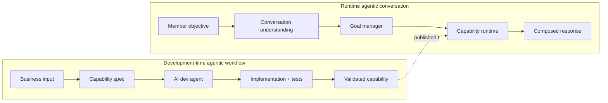
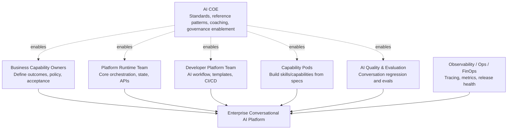
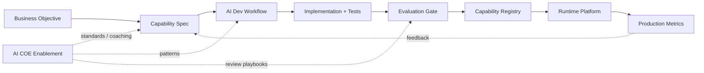
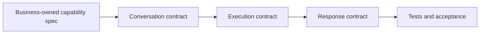
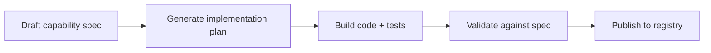
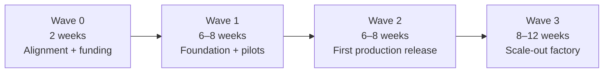

# Enterprise Conversational AI Platform Operating Model

## Slide 1 — Enterprise Conversational AI Platform
**Subtitle:** Operating Model, Workstreams, and Delivery Plan

**Message:** Business owns the what. Platform owns the runtime. AI accelerates delivery. Quality governs release.

**Speaker notes:**
Open by positioning this as an operating model, not only a staffing request. The message is: the platform is reusable, capabilities scale independently, and AI COE enables teams without becoming the bottleneck. Reassure leadership that this proposal keeps execution governed while improving delivery speed and member experience.

---

## Slide 2 — Why this cannot be delivered like a traditional chatbot project

**Traditional delivery model:** One team builds intents, slots, prompts, code hooks, tests, and releases.

**Target delivery model:** A reusable platform plus parallel capability teams, guided by specs, evaluations, and shared standards.

**Speaker notes:**
This slide frames the staffing question correctly. We are not asking for one large chatbot team. We are proposing parallel workstreams: a core platform team, capability teams, evaluation and observability, cloud operations, and AI COE enablement. The business value is scale: once the platform and development workflow exist, multiple capabilities can move in parallel.

---

## Slide 3 — Two agentic systems must work together

**Speaker notes:**
This is the important new framing. There are two agentic stories. The first is development-time: AI helps write specs, implementation, tests, and validation assets. The second is runtime: AI helps understand the member objective and orchestrate the right capability safely. This separation helps leadership see that AI is not only in the chatbot; AI is also changing how we build and validate capabilities.

---

## Slide 4 — Target operating model

**Speaker notes:**
This slide answers who needs to participate without turning the AI COE into the delivery bottleneck. Platform runtime builds the shared engine. Capability pods build business capabilities. Business owns the what and acceptance. AI Quality and Observability are not afterthoughts; they are workstreams from day one. AI COE is shown as an enablement layer across all teams: standards, patterns, coaching, and governance support.

---

## Slide 5 — Workstream map and responsibilities

| # | Workstream | Mission | Team size | Parallelization |
|---|---|---|---:|---|
| 1 | Platform Runtime | Orchestrator, LangGraph, state, providers, APIs | 5–7 | Starts day 1 |
| 2 | Developer Platform | Spec tooling, AI dev workflow, templates, CI/CD | 3–4 | Starts day 1 |
| 3 | Capability Pods | Business capability specs, tools, prompts, tests | 3–5 per pod | Starts after baseline |
| 4 | AI Quality & Evaluation | Conversation regression, eval gates, red-team suites | 4–6 | Starts day 1 |
| 5 | Observability / Ops / FinOps | Tracing, KPIs, cost, release health, incidents | 2–4 | Starts day 1 |
| 6 | Cloud / Security / Infra | AWS landing zone, IAM, network, secrets, deployment | 4–6 | Starts day 1 |
| 7 | AI COE Enablement | Standards, patterns, coaching, governance guidance | 2–4 matrixed | Advisory / ongoing |

**Speaker notes:**
Use this slide when leadership asks how many people are needed. Do not present a single headcount number first. Present workstreams and the scaling model. Team sizes are indicative. The core platform must be stable; capability pods can be added or removed based on business demand. The key message is that some teams start immediately while capability pods ramp after a platform baseline exists.

---

## Slide 6 — How work flows through the organization

**Speaker notes:**
This is the centerpiece visual. The organization becomes a capability factory. Business defines the objective and acceptance criteria. The development-time AI workflow helps convert that into a spec, implementation, tests, and validation. A capability is not published into runtime until it passes evaluation gates. Production metrics feed back into specs and tests, creating continuous improvement.

---

## Slide 7 — Platform Runtime workstream

**Owns:**
- Conversational orchestration with LangGraph
- Session, state, checkpoint, and goal management
- Model provider abstraction: start with OpenAI; remain provider-neutral
- Capability runtime and tool execution contracts
- Response composer, guardrail integration, and channel adapters

**Speaker notes:**
The platform runtime is the shared engine. It should not be modified for every new business capability. This team owns the reusable components: orchestration, state, model abstraction, capability runtime, response composition, guardrails, and integration contracts. This is also where we keep vendor neutrality: OpenAI may be the first adapter, but platform components do not directly depend on a specific inference provider.

---

## Slide 8 — Capability pods: business skills built from specs

**Capability pod composition:** Product/SME, conversation designer, engineer/tool adapter, AI Quality engineer, platform partner.

**Speaker notes:**
This slide shows how business becomes part of delivery without needing to code. Capabilities are not just prompts. They have conversation contracts, execution contracts, response contracts, policies, and tests. The platform team provides the runtime; capability pods bring business capabilities into that runtime using standardized specifications.

---

## Slide 9 — Development-time AI workflow: spec-driven capability creation

**Development AI skills:** Spec Writer, Architecture Mapper, Implementation Builder, Evaluation Generator, Spec Validator.

**Speaker notes:**
This addresses the new concern from today: development-time agentic is different from runtime agentic. The Copilot or Codex-like agent should be treated as part of the developer platform. It helps create specifications, code, and tests, then validates implementation against the spec. This is how teams move faster without abandoning engineering discipline.

---

## Slide 10 — AI Quality & Evaluation Engineering

**Traditional QA:** manual scripted flows, late validation, pass/fail UI test mindset.

**AI Quality Engineering:** conversation regression, objective/capability selection accuracy, response contract and guardrail compliance.

**Evaluation Platform:** golden conversations, synthetic tests, CI/CD gates, production dashboards.

**Speaker notes:**
This slide is important for protecting your existing QA team and evolving their role. AI quality is not only functional testing. It is behavior evaluation over many conversation patterns. This workstream owns repeatable conversation regression suites, golden scenarios, synthetic conversations, prompt/version evaluation, and production quality metrics.

---

## Slide 11 — Observability, analytics, and FinOps are product capabilities

**Core metrics:** member success, conversation health, model quality, runtime health, and cost health.

**Recommended pattern:** OpenTelemetry-first instrumentation, with Langfuse or LangSmith as visualization backends.

**Speaker notes:**
A conversational AI platform cannot be managed only by uptime and logs. Leadership needs outcome metrics: completion rate, fallback rate, escalation, cost per completed objective, response compliance, and quality trends over time. We should instrument from day one, even if dashboards mature over time.

---

## Slide 12 — AI COE role: enable every team, do not become the bottleneck

**AI COE should own:** reference architecture, standards, reusable assets, architecture reviews, model/vendor guidance, coaching.

**Product/platform teams should own:** delivery outcomes, runtime implementation, capability specs, production dashboards, incidents, releases.

**Speaker notes:**
The AI COE should not become the team that everyone waits on. Their highest-value role is enablement: standards, reusable assets, review patterns, training, and model/vendor guidance. The platform and product teams must still own the outcomes and delivery.

---

## Slide 13 — Delivery roadmap: build platform once, scale capabilities in waves

**Speaker notes:**
Avoid making this sound like one big-bang date. Use waves. Wave 1 proves the reusable platform and development workflow. Wave 2 moves into production and expands capabilities. Wave 3 scales the factory model. These ranges are planning estimates and should be refined after backlog sizing and integration discovery.

---

## Slide 14 — Staffing options for funding discussion

| Option | Team profile | Best fit |
|---|---|---|
| Lean MVP | 8–12 core contributors, 1 capability pod, 1–2 pilot capabilities | Proof and controlled rollout |
| Enterprise launch | 15–22 contributors, 2 capability pods, production eval and observability | First business release |
| Scale-out factory | 25–40+ across streams, 3+ capability pods, continuous onboarding | Enterprise adoption |

**Speaker notes:**
This slide gives leadership options without overcommitting to one number before detailed planning. The important model is modular funding: core platform is stable; capability pods scale with business demand. The enterprise launch option is a realistic target if the organization wants production readiness rather than a prototype.

---

## Slide 15 — Recommended decision

**Approve a platform-led delivery model with parallel capability pods and AI Quality from day one.**

**Decision needed:** confirm executive sponsor, approve Wave 0/1 staffing, select first pilot capabilities, assign AI COE enablement partners.

**Speaker notes:**
Close with a specific ask, not a generic vision. The ask is to fund the foundation, launch the first capability pod, and stand up quality/observability as part of the initial release—not later. Reinforce: build platform once, build capabilities many times.
