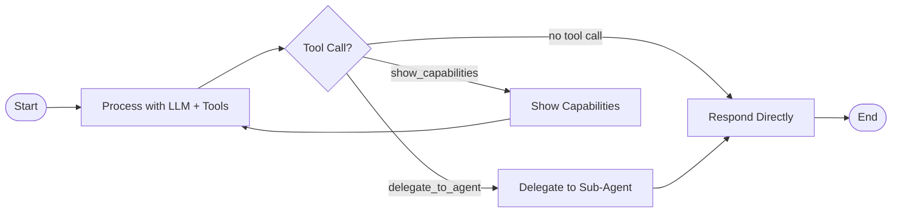

# Blueprint: Main Agent — LangGraph StateGraph

## Purpose
Defines the Main Agent's LangGraph StateGraph — the orchestrator's decision-making flow. The graph handles session checking, greeting, intent classification via LLM with tools, delegation to sub-agents, graceful decline, and response handling.

## Implements Features
- F-001: Member Greeting & Session Management
- F-003: Skill-Based Routing & Delegation
- F-004: Graceful Capability Decline

## State Schema

### `MainAgentState(TypedDict)`

```python
class MainAgentState(TypedDict):
    """State for the Main Agent graph."""
    messages: Annotated[List[Dict[str, Any]], add_messages]  # Conversation messages
    system_prompt: str               # Assembled system prompt
    tools: List                      # Available tools
    user_input: str                  # Current member input
    response: str                    # Final response to member
    reasoning: str                   # LLM reasoning for debug panel
    tool_call: Optional[Dict]        # Pending tool call (if any)
    is_new_session: bool             # Whether this is a new session
    capabilities: List[Dict]         # Discovered agent capabilities
    delegation_result: Optional[str] # Response from delegated sub-agent
```

## Graph Definition



### Design Decision: Simplified Graph

The PRD shows a multi-node graph (check_session → greet → classify → route → delegate). After analysis, this is better implemented as a **simpler ReAct-style graph** where:
- Session checking and greeting are handled via **system prompt context** (already implemented in the current `invoke()`)
- The LLM with tools does the classification and routing in a **single process node**
- The graph's value is in the **conditional routing** after the LLM decides

This is consistent with the PRD's §5.7 rationale: "Simple agents get simple graphs." The orchestrator's complexity is in its **tools and system prompt**, not in graph topology.

## Graph Construction

```python
def build_graph(tools: List) -> CompiledGraph:
    """Build the Main Agent state graph.

    Graph: START → process → [route] → delegate/respond → END
    """
    graph = StateGraph(MainAgentState)

    graph.add_node("process", process_node)
    graph.add_node("delegate", delegate_node)
    graph.add_node("tool_response", tool_response_node)
    graph.add_node("respond", respond_node)

    graph.add_edge(START, "process")
    graph.add_conditional_edges("process", route_after_process, {
        "delegate": "delegate",
        "tool_response": "tool_response",
        "respond": "respond",
    })
    graph.add_edge("delegate", "respond")
    graph.add_edge("tool_response", "process")  # Loop back for multi-turn tool use
    graph.add_edge("respond", END)

    return graph.compile()
```

### Conditional Edge: `route_after_process`

```python
def route_after_process(state: MainAgentState) -> str:
    """Route based on LLM's decision."""
    tool_call = state.get("tool_call")
    if not tool_call:
        return "respond"           # Direct text response (greeting, decline, etc.)
    if tool_call["name"] == "delegate_to_agent":
        return "delegate"          # Delegation to sub-agent
    return "tool_response"         # Other tool (show_capabilities) — execute and loop
```

## Node Contracts

Each node is defined in `nodes.py`. See `specs/blueprints/main_agent/nodes.spec.md` for details.

## Acceptance Criteria

- [ ] Graph is a `StateGraph(MainAgentState)` compiled with `graph.compile()`
- [ ] Graph has nodes: `process`, `delegate`, `tool_response`, `respond`
- [ ] Graph has conditional routing after `process` based on tool_call presence
- [ ] `delegate_to_agent` tool calls route to `delegate` node
- [ ] `show_capabilities` tool calls route to `tool_response` node (loop back)
- [ ] No tool call routes to `respond` node (direct text response)
- [ ] Graph handles greeting via system prompt context (not a separate node)
- [ ] Graph handles graceful decline via LLM reasoning (not a separate node)
- [ ] `delegate` node flows to `respond` (to wrap the delegation result)
- [ ] `tool_response` node flows back to `process` (for multi-turn tool use)

## Dependencies
- `langgraph` (StateGraph, START, END, add_messages)
- `core.types` (Message, AgentResult)
- `main_agent/nodes.py` (node functions)
- `main_agent/tools.py` (tool definitions)
- `main_agent/state.py` (MainAgentState)
